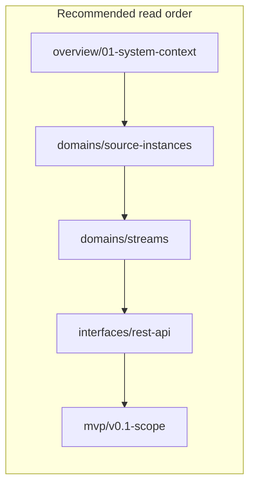

# Kithara Architecture Documentation

<!-- mermaid-source: docs/architecture/diagrams/read-order.mmd -->

Deep-dive architecture for **Kithara** — the Bardie core backend. For ecosystem orientation, start at the [org architecture hub](https://github.com/Bardie-radio/.github/tree/main/profile/docs/architecture).

## Quick links

| Section | Purpose |
|---------|---------|
| [Glossary](glossary.md) | Codenames + plain English |
| [Overview](overview/) | System context, internal structure, data flow |
| [Domains](domains/) | Streams, source instances, auth, playback |
| [Interfaces](interfaces/) | REST, gRPC, streaming, routing |
| [Operations](operations/) | Deploy, config, observability |
| [ADRs](adrs/) | Architecture decision records |
| [MVP](mvp/) | v0.1 scope and milestones |
| [Spike](spike/) | Prototype assessment |

## Read paths

**New contributor** — `overview/01` → `glossary` → `domains/source-instances` → `adrs/001`–`004`

**Module author** — `interfaces/grpc-source-module` → `interfaces/grpc-auth-adapter` → `operations/observability`

**Self-hoster** — [org deployment](https://github.com/Bardie-radio/.github/blob/main/profile/docs/architecture/05-deployment.md) → `operations/deployment` (this container) → `mvp/v0.1-scope` → `interfaces/uri-routing`

## Child pages

### Overview
- [01-system-context](overview/01-system-context.md)
- [02-internal-structure](overview/02-internal-structure.md)
- [03-runtime-data-flow](overview/03-runtime-data-flow.md)

### Domains
- [source-instances](domains/source-instances.md)
- [streams](domains/streams.md)
- [struna-access](domains/struna-access.md)
- [source-modules](domains/source-modules.md)
- [auth-adapters](domains/auth-adapters.md)
- [playback-control](domains/playback-control.md)
- [library-and-tunes](domains/library-and-tunes.md)
- [storage](domains/storage.md)
- [clients](domains/clients.md)

### Interfaces
- [rest-api](interfaces/rest-api.md)
- [grpc-source-module](interfaces/grpc-source-module.md)
- [grpc-auth-adapter](interfaces/grpc-auth-adapter.md)
- [uri-routing](interfaces/uri-routing.md)
- [http-stream-output](interfaces/http-stream-output.md)
- [streaming-stack](interfaces/streaming-stack.md)
- [auth](interfaces/auth.md)

### Operations
- [deployment](operations/deployment.md)
- [configuration](operations/configuration.md)
- [observability](operations/observability.md)

### MVP
- [v0.1-scope](mvp/v0.1-scope.md)
- [v0.1-milestones](mvp/v0.1-milestones.md)

### Spike
- [prototype-neck-ffmpeg](spike/prototype-neck-ffmpeg.md)

### ADRs
- See [adrs/](adrs/)
