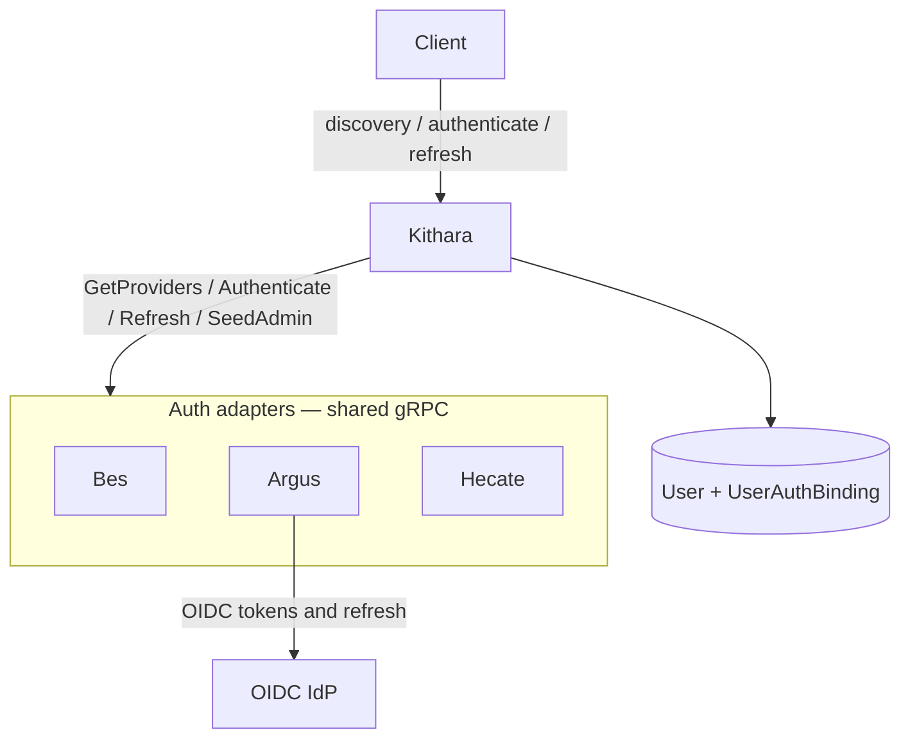

# Auth Adapters

Auth modules plug into Kithara’s **Auth Orchestrator** over one shared gRPC contract. Modules are **decoupled** from each other — deploying Bes does not configure Argus, and vice versa. There is no built-in auth inside Kithara.

**Split of responsibility:**

| Layer | Owns |
|-------|------|
| **Auth module** (Bes, Argus, Hecate, …) | Authenticate/verify; **issue or forward login JWTs**; **refresh** (Argus → IdP; others mint their own); return allow + rights/entities; optional “store this user/binding”; optional **`SeedAdmin`** when capability advertised |
| **Kithara** | Sole user DB; **verify** login JWTs via module JWKS; **mint/verify ephemeral guest JWTs**; listen/guest secrets; **join secrets**; merge discovery; route opaque auth/refresh; orchestrate `seedAdmin` |

Everything user-facing for **login** uses the **same JWT protocol** from auth modules. Argus typically **passes through** OIDC tokens; Bes/Hecate **forge** their own JWTs. Kithara does not mint login access tokens — it mints JWTs only for **ephemeral guest users** after guest-code exchange.




## Providers

| Provider | Shape | Role |
|----------|-------|------|
| **Bes** (MVP) | Container `bes` | Login+password; mints JWT; discovery `form_schema` — deep dive: [Bes docs](https://github.com/Bardie-radio/bes/tree/main/docs/architecture) |
| **Argus** (v0.2) | Container `argus` | OIDC; forwards IdP JWT — [planned](https://github.com/Bardie-radio/argus/blob/main/docs/architecture/01-planned-role.md) |
| **Hecate** (future) | Container `hecate` | Passkeys — [planned](https://github.com/Bardie-radio/hecate/blob/main/docs/architecture/01-planned-role.md) |

## Client UI and public edge

**User-facing surfaces** are Kithara (REST / callbacks) and UI client modules (Plume, Beak, Cauda, …). Auth adapters stay on the **internal** network.

Clients render login UI from discovery by switching on `ProviderDescriptor.ui` (typed oneof) — **not** on provider/module name:

- `form_schema` — client renders `FormField` list (MVP Bes)
- `redirect` — browser goes to `authorize_url`; returns to a **Kithara** callback
- future ceremony case for passkeys — still mode-based, not `if hecate`

Adapters do **not** expose a public HTTP login surface.

### Can auth stay fully behind Kithara?

**Intent: yes** for the planned modules — BFF-style. Summary:

- **Bes** — credentials POST to Kithara → gRPC `Authenticate` → Bes mints JWT ([Bes contracts](https://github.com/Bardie-radio/bes/blob/main/docs/architecture/02-contracts.md)).
- **Argus** — IdP redirect → Kithara callback → Argus forwards IdP JWTs ([planned](https://github.com/Bardie-radio/argus/blob/main/docs/architecture/01-planned-role.md)).
- **Hecate** — WebAuthn via Kithara ↔ Hecate; Hecate mints JWT ([planned](https://github.com/Bardie-radio/hecate/blob/main/docs/architecture/01-planned-role.md)).

The only other public party in OIDC is the **IdP** itself. Adapters do **not** expose a public HTTP login surface.

## User core + binding store

```text
User
  id, created_at, status, …     ← Kithara-owned only

UserAuthBinding
  user_id + provider_slug       ← composite key (bes, argus, hecate, …)
  external_subject?             ← module-supplied subject
  payload (JSON)                ← dynamic data the module asks Kithara to store
```

| Provider | Typical `payload` examples |
|----------|----------------------------|
| Bes | password hash, reset metadata |
| Argus | `sub`, claims snapshot, IdP refresh handle if needed |
| Hecate | credential ids / attestation metadata |

First successful login can JIT-provision a `User` + binding when the module asks Kithara to store the user.

User **kinds** (durable / managed / ephemeral guest) — [glossary](../glossary.md). Ephemeral guests have no `UserAuthBinding`.

### First admin / empty DB (`seedAdmin`)

Auth modules **advertise capabilities** at Registry join. Modules that can invent local users (Bes) advertise `seedAdmin`. Modules that only reflect remote IdPs (Argus) typically do not.

When the DB is empty, Kithara calls `SeedAdmin` on a capable adapter. The module creates an admin with a random secret, Kithara persists the user + binding, and Kithara logs the module’s welcome text (credentials) to the **Kithara container log**. Seeded admins must rotate credentials on first login (`must_rotate_credentials`). Privileged RPC — only Kithara may invoke it. Details: [grpc-auth-adapter](../interfaces/grpc-auth-adapter.md).

## Account linking

Users may **explicitly** link/merge bindings from different providers (prove both sides). No auto-link by email.

**Provider priority tier-list** (env/config at container start; admin API optional later) orders provider slugs when mapped org roles/claims disagree. Struna ACLs are unaffected — they stay in Kithara.

## Join secrets vs user JWTs

**Join secrets** authenticate modules (register / heartbeats / static admin). They are not user session credentials. **Static** client modules (e.g. Beak) use their join secret only to administer **module-managed users**; day-to-day API calls use **per-user credentials** — see [clients](clients.md).

**Related:** [interfaces/auth.md](../interfaces/auth.md) · [interfaces/grpc-auth-adapter.md](../interfaces/grpc-auth-adapter.md) · [ADR 007](../adrs/007-auth-adapter-modules.md)

**Read next:** [library-and-tunes.md](library-and-tunes.md)
