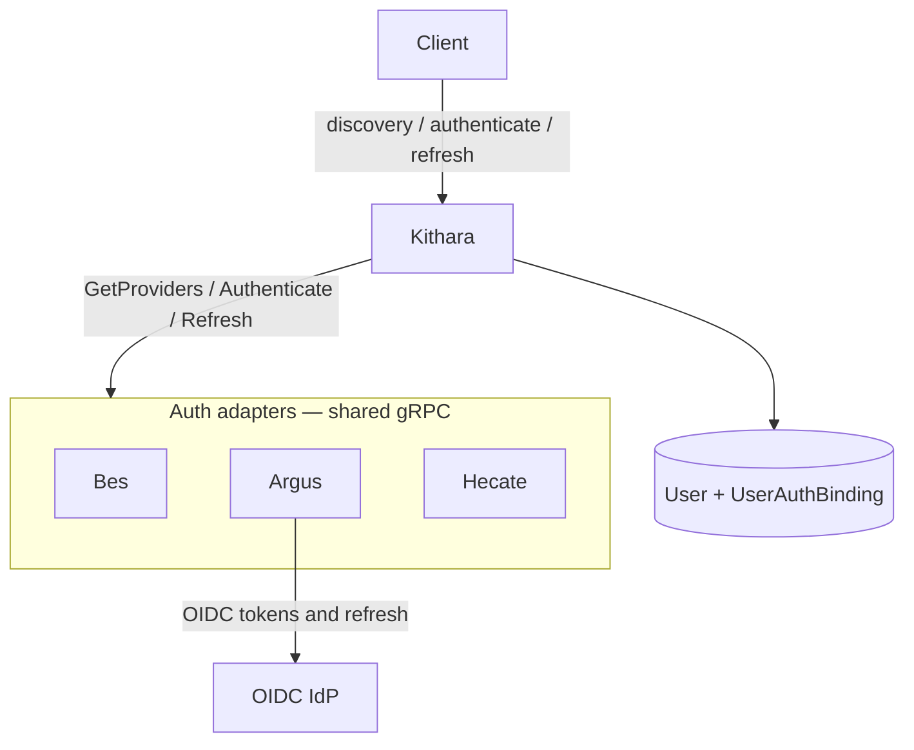

# Auth Adapters

Auth modules plug into Kithara’s **Auth Orchestrator** over one shared gRPC contract. Modules are **decoupled** from each other — deploying Bes does not configure Argus, and vice versa. There is no built-in auth inside Kithara.

**Split of responsibility:**

| Layer | Owns |
|-------|------|
| **Auth module** (Bes, Argus, Hecate, …) | Authenticate/verify; **issue or forward JWTs**; **refresh** (Argus → IdP; others mint their own); return allow + rights/entities; optional “store this user/binding” |
| **Kithara** | Sole user DB; **verify** user JWTs via module JWKS; **mint/verify guest control JWTs**; listen/guest secrets; **join secrets**; merge discovery; route opaque auth/refresh payloads |

Everything user-facing for **login** uses the **same JWT protocol** from auth modules. Argus typically **passes through** OIDC tokens; Bes/Hecate **forge** their own JWTs. Kithara does not mint user access tokens — it may mint Struna-scoped **guest control JWTs** after guest-code exchange.



## Providers

| Provider | Shape | Role |
|----------|-------|------|
| **Bes** (MVP) | Container `bes` | Login+password; mints JWT; discovery `form_schema`; slug `bes` |
| **Argus** (v0.2) | Container `argus` | OIDC; forwards IdP JWT; refresh via IdP; discovery `redirect`; slug `argus` |
| **Hecate** (future) | Container `hecate` | WebAuthn / passkeys; mints JWT; slug `hecate` |

## Client UI and public edge

**User-facing surfaces** are Kithara (REST / callbacks) and UI client modules (Plume, Beak, Cauda, …). Auth adapters stay on the **internal** network.

Clients render login UI from discovery:

- `form_schema` — client renders fields (MVP Bes)
- `redirect` — browser goes to an external authorize URL from discovery; returns to a **Kithara** callback
- `embed` — prefer avoid; not required for MVP

Adapters do **not** expose a public HTTP login surface.

### Can auth stay fully behind Kithara?

**Intent: yes** for the planned modules — BFF-style:

- **Bes** — credentials POST to Kithara → gRPC `Authenticate` → Bes returns JWT.
- **Argus** — browser hits the IdP (external), then Kithara’s callback; Kithara → Argus `Authenticate`; Argus returns/forwards IdP JWTs; refresh later goes Argus → IdP.
- **Hecate** — WebAuthn ceremony browser ↔ Kithara ↔ Hecate; Hecate returns JWT.

The only other public party in OIDC is the **IdP** itself (redirect). If a future protocol truly required a public adapter URL, that would need an explicit exception — not the default.

## User core + binding store

```text
User
  id, created_at, status, …     ← Kithara-owned only

UserAuthBinding
  user_id + provider_slug       ← composite key (bes, argus, hecate, …)
  external_subject?             ← module-supplied subject
  payload (JSON)                ← dynamic data the module asks Kithara to store
```

| Provider | Typical `payload` examples |
|----------|----------------------------|
| Bes | password hash, reset metadata |
| Argus | `sub`, claims snapshot, IdP refresh handle if needed |
| Hecate | credential ids / attestation metadata |

First successful login can JIT-provision a `User` + binding when the module asks Kithara to store the user.

**First admin / empty DB:** operator-controlled user creation (typical for Bes deploys) — not a Kithara container env knob. Usually unused when only Argus is deployed (admins come from the IdP). Details live with user management, not [configuration](../operations/configuration.md).

## Account linking

Users may **explicitly** link/merge bindings from different providers (prove both sides). No auto-link by email.

**Provider priority tier-list** (env/config at container start; admin API optional later) orders provider slugs when mapped org roles/claims disagree. Struna ACLs are unaffected — they stay in Kithara.

## Join secrets vs user JWTs

**Join secrets** authenticate modules (register / heartbeats / static admin). They are not user session credentials. **Static** client modules (e.g. Beak) use their join secret only to administer **module-managed users**; day-to-day API calls use **per-user credentials** — see [clients](clients.md).

**Related:** [interfaces/auth.md](../interfaces/auth.md) · [interfaces/grpc-auth-adapter.md](../interfaces/grpc-auth-adapter.md) · [ADR 007](../adrs/007-auth-adapter-modules.md)

**Read next:** [library-and-tunes.md](library-and-tunes.md)
