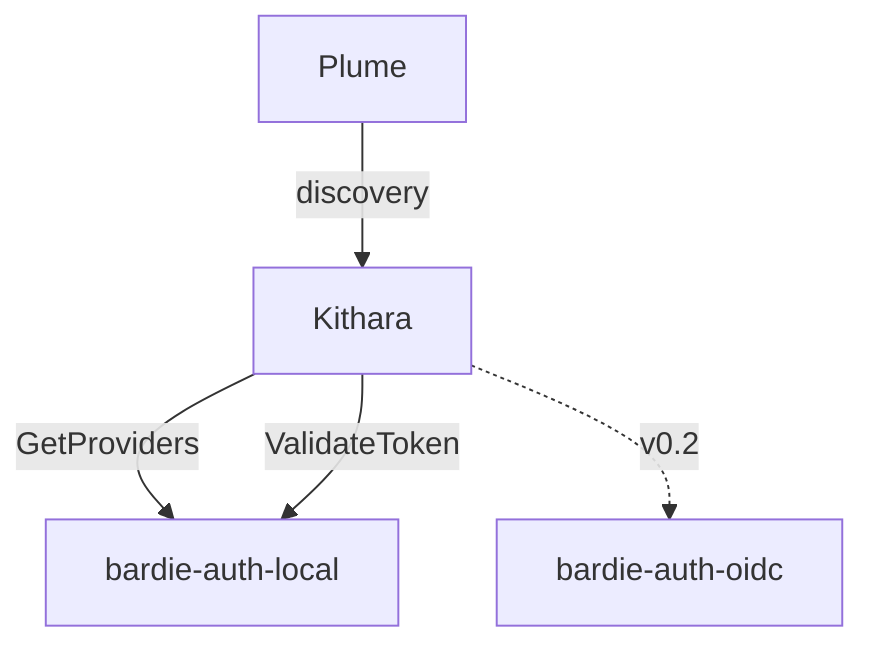

# Auth Adapters

**Auth adapters** mirror source modules: separate repos/containers registered with Kithara's **auth orchestrator** (inside Kithara, not a separate core).

## MVP

| Repo | Role |
|------|------|
| `bardie-auth-local` | Login+password, token issuance, `form_schema` UI |

## v0.2+

| Repo | Role |
|------|------|
| `bardie-auth-oidc` | External OIDC (Zitadel, Google, …) |

## Adapter-owned login UI

Plume does **not** hardcode auth forms. Discovery returns `uiMode`:

- `form_schema` — Plume renders fields from adapter metadata (MVP)
- `embed` — iframe adapter login page
- `redirect` — OIDC / external IdP

## Service tokens

Bots and automation use **pre-provisioned tokens** in Kithara config — no auth adapter container.

**Related:** [interfaces/auth.md](../interfaces/auth.md) · [interfaces/grpc-auth-adapter.md](../interfaces/grpc-auth-adapter.md) · [ADR 007](../adrs/007-auth-adapter-modules.md)

**Read next:** [library-and-tunes.md](library-and-tunes.md)
