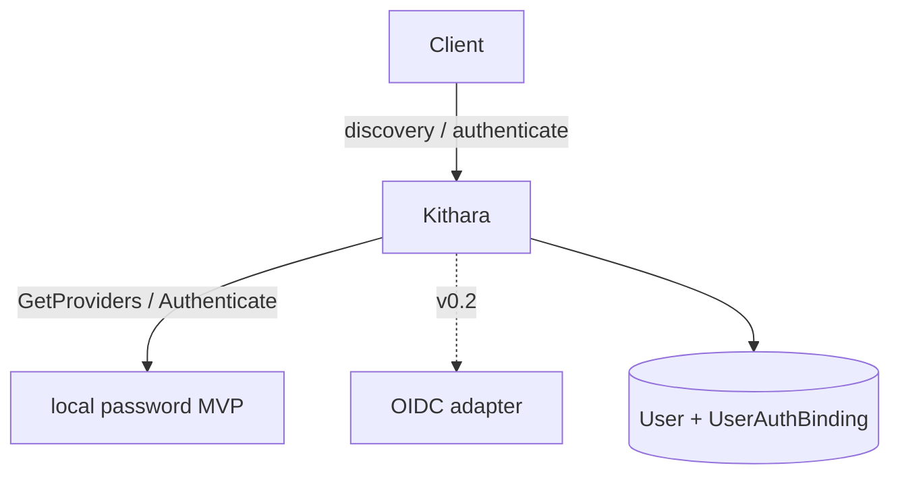

# Auth Adapters

Auth providers plug into Kithara’s **Auth Orchestrator**. Identity proof is modular; **sessions, users, listen tokens, and guest codes** stay in Kithara’s one database.



## Modes

| Mode | Behavior |
|------|----------|
| **Local** | Built-in login+password; env bootstrap admin on empty DB |
| **OIDC** | External IdP (e.g. Zitadel) owns user lifecycle; local bootstrap/password disabled when OIDC is configured from the start |
| **Both** | Optional later; same user + binding schema |

## Providers

| Provider | Shape | Role |
|----------|-------|------|
| **local** (MVP) | In-process inside Kithara | Username/password; `form_schema` for clients |
| **OIDC** *(name TBD, v0.2)* | External container | Code exchange / IdP talk; callback on **Kithara** |

Module and repo names for external adapters are undecided.

## Client UI (not adapter-hosted)

Clients render auth UI from discovery:

- `form_schema` — client renders fields (MVP local)
- `redirect` — browser goes to IdP URL from discovery; returns to Kithara callback
- `embed` — prefer avoid; not required for MVP

Adapters do **not** expose a public HTTP login surface.

## User core + binding store

```text
User
  id, created_at, status, …     ← Kithara-owned only

UserAuthBinding
  user_id + provider_slug       ← composite key
  external_subject?             ← e.g. OIDC sub
  payload (JSON)                ← provider-specific
```

| Provider | Typical `payload` |
|----------|-------------------|
| local | password hash, reset metadata |
| OIDC | `sub`, claims snapshot, IdP refresh handle if needed |

External adapters read/write bindings **through Kithara** (gRPC). They do not own a Bardie user database. First OIDC login can JIT-provision a `User` + binding.

## Account linking

Users may **explicitly** link/merge bindings from different providers (prove both sides). No auto-link by email.

**Provider priority tier-list** (env/config at container start; admin API optional later) orders provider slugs when mapped org roles/claims disagree. Struna ACLs are unaffected — they stay in Kithara.

## Service tokens

Bots use pre-provisioned tokens in Kithara config — no auth adapter required.

**Related:** [interfaces/auth.md](../interfaces/auth.md) · [interfaces/grpc-auth-adapter.md](../interfaces/grpc-auth-adapter.md) · [ADR 007](../adrs/007-auth-adapter-modules.md)

**Read next:** [library-and-tunes.md](library-and-tunes.md)
