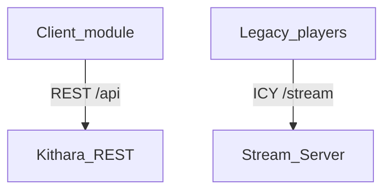

# Client modules (Kithara contract)

What Kithara treats as a **client module**, how it attaches to core, and which credentials it may use on `/api`. The catalog of planned clients (Plume, Beak, Cauda, …) lives in the [org client modules](https://github.com/Bardie-radio/.github/blob/main/profile/docs/architecture/06-client-modules.md) page.

## What counts as a client module

A **client module** is a separate deployable that presents Bardie on some channel (web, chat, bot, …) and drives Strunas through Kithara’s **REST API**. It registers (or is expected to) with a join secret and an auth mode, calls `/api` for create/control/search/queue, and may provide player capabilities

Out of scope for “client module”: legacy players (VLC, direct browser playback, etc) that only hit `GET /stream/{slug}`, no control over system or authorization in most cases

Kithara does **not** serve `/` or `/player/`* — those belong to a UI client (typically Plume) at the edge. See [uri-routing](../interfaces/uri-routing.md).

## Auth modes (contract)

When a client module registers, it declares how it authenticates to `/api`:

| Mode           | Meaning                                                                      | Credential on `/api`                                                         |
| -------------- | ---------------------------------------------------------------------------- | ---------------------------------------------------------------------------- |
| **user-aware** | End users log in; module acts with their identity                            | Bearer **user JWT** from an auth module (via Kithara discovery/authenticate) |
| **static**     | No human Bardie login through this UI; module owns **many** persistent users | **Join secret** (admin only) + **per-user credentials** (day-to-day)         |

Module-level **capability rights** (what the static app may do at all) are declared at registration. Per-user / Struna ACLs still live in Kithara.

### Static modules and module-managed users

Do **not**:

| Shape                                                     | Why not                              |
| --------------------------------------------------------- | ------------------------------------ |
| One user for the whole static module                      | Shared identity across every tenancy |
| One user per short-lived session (e.g. per voice channel) | Too many users; session ≠ tenancy    |
| Many users all acting under the **same** join secret      | Shared-secret impersonation          |

**Chosen shape:** join secret for **module admin** (create/list/revoke managed users); each **tenancy boundary** gets a durable `User` with **distinct** credentials for day-to-day `/api`. Kithara records `managed_by_module` + external tenancy ref. Concrete tenancy keys (e.g. Discord guild) are module-specific — see [org catalog](https://github.com/Bardie-radio/.github/blob/main/profile/docs/architecture/06-client-modules.md) and each module’s docs.

## Attachment to core

1. **Register** — join secret + auth mode (`user-aware`  `static`) + static module rights when static (REST or thin join RPC — sketch)
2. **Auth** — user JWT; or join secret for managed-user admin + per-user credentials for API work
3. **Control** — REST playback/queue/search as in [rest-api](../interfaces/rest-api.md)
4. **Listen** — optional; `/stream/{slug}` (or embed). Not required to be a client module

Day-to-day control is **REST only** (no source/auth gRPC from the client). Compose / join-secret wiring: [org deployment](https://github.com/Bardie-radio/.github/blob/main/profile/docs/architecture/05-deployment.md) · [operations/deployment](../operations/deployment.md).

## OTel

Client modules export OTLP (`bardie.plume`, `bardie.beak`, `bardie.cauda`, …) into the same graph as Kithara ([ADR 008](../adrs/008-otel-observability.md)).

**Related:** [org client modules](https://github.com/Bardie-radio/.github/blob/main/profile/docs/architecture/06-client-modules.md) · [auth.md](../interfaces/auth.md) · [struna-access.md](struna-access.md) · [uri-routing.md](../interfaces/uri-routing.md)

**Read next:** [../interfaces/rest-api.md](../interfaces/rest-api.md)