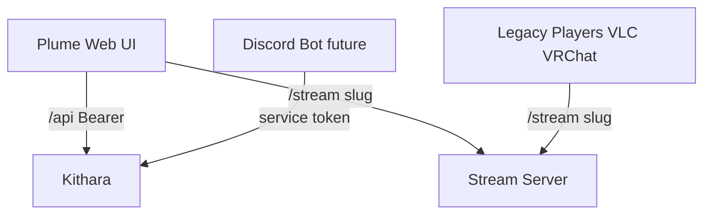

# Clients

## Plume (web UI)

| Route | Role |
|-------|------|
| `/` | Main page — list/create Strunas (auth required) |
| `/player/{slug}` | Queue control; browser player **off by default**; PWA later |

Plume is a **client shell** — delegates login UI to auth adapters.

## Legacy players

VLC, VRChat, etc. connect to `GET /stream/{slug}` with ICY-over-HTTP. Work with **public** and **protected** (token URL) playback modes.

## Discord bot (future)

Uses **service token**; creates protected Strunas or controls via API.

## OTel

Plume exports full OTLP — first-class in trace graph ([ADR 008](../adrs/008-otel-observability.md)).

**Related:** [interfaces/uri-routing.md](../interfaces/uri-routing.md) · [domains/struna-access.md](struna-access.md)

**Read next:** [../interfaces/rest-api.md](../interfaces/rest-api.md)
