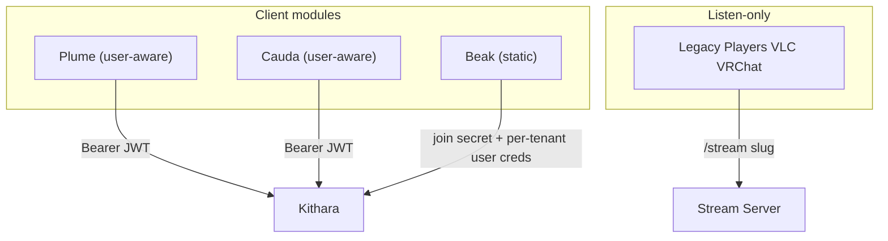

# Clients

Bardie's **user-facing surface is modular**. Client modules are separate deployable components that talk to Kithara's REST API — they are not baked into the core. Pick the interfaces that match how your community communicates.

| Module | Channel | Auth mode | MVP | Role |
|--------|---------|-----------|-----|------|
| **Plume** | Web | **user-aware** | Yes (optional) | List/create Strunas, control playback, optional in-browser listen |
| **Cauda** | Telegram | **user-aware** | Future | Remote Struna control from chats (Telegram user ↔ Bardie user) |
| **Beak** | Discord | **static** | Future | Play into VCs; **module-managed users** isolated per Discord guild |

**Legacy players** (VLC, VRChat, etc.) connect to `GET /stream/{slug}` for listen-only playback. They are not client modules — no REST control surface.

## Registration: user-aware vs static

Client modules register with Kithara (**join secret** + metadata). Part of that payload is how the module authenticates to `/api`:

| Mode | Meaning | Credential on `/api` | Current modules |
|------|---------|----------------------|-----------------|
| **user-aware** | End users log in; module acts with their identity | Bearer **JWT** from an auth module | **Plume**, **Cauda** |
| **static** | No human Bardie login through this UI; module owns **many** persistent users | **Join secret** (admin) + **per-user credentials** (day-to-day) | **Beak** |

Module-level **capability rights** (what the static app is allowed to do at all) are declared at **module registration**. Per-user rights/ACLs still live on each managed `User` / Struna as usual.

### Static modules and module-managed users

Rejected shapes:

| Shape | Why not |
|-------|---------|
| One user for the whole static module | Public Beak would share one identity across every Discord server → every guild sees every Struna |
| One user per voice channel | Too many users; VC is a Struna lifetime, not a tenancy boundary |
| Many users, all acting under the **same** join secret | Shared secret impersonation — any caller with the join secret can act as any managed user |

**Chosen shape:**

1. Static module registers with its **join secret**, used for **module admin** work: create/list/revoke **module-managed users**, not for ordinary Struna control as “whatever user.”
2. The module asks Kithara to create a **persistent** `User` (module-managed) for each **tenancy boundary**. For **Beak**, that boundary is a **Discord guild** (server) — not the whole bot, not each VC.
3. On create, Kithara returns **distinct credentials** for that user (API key and/or JWT material Beak stores). Day-to-day `/api` calls (create Struna for a VC, play, queue) use **that user’s** credential.
4. Kithara records `managed_by_module = beak` (and Beak’s external ref, e.g. `guild_id`) on the user so tenancy stays enforceable server-side.
5. Voice channels map to **Strunas owned by the guild’s managed user** — many Strunas, one user per guild.

**Persistence:** module-managed users are **durable** `User` rows (listening history, owned library/static tracks, Struna ownership over time). They are not throwaway session principals.

Other static modules pick their own tenancy key the same way (e.g. Telegram bot would use a different separator if it were static — Cauda is user-aware instead).

## Plume (web UI)

| Route | Role |
|-------|------|
| `/` | Main page — list/create Strunas (auth required) |
| `/player/{slug}` | Queue control; browser player **off by default**; PWA later |

Plume is the **reference user-aware client** for MVP — the stack still works without it (Kithara owns login/callback). Plume renders login UI from discovery (`form_schema` / redirect); it does not talk to auth adapters directly ([ADR 007](../adrs/007-auth-adapter-modules.md)).

Image/Compose: `plume`. OTel: `bardie.plume`.

## Cauda (Telegram)

User-aware control surface: Telegram users authenticate (JWT via auth modules) and manage Strunas from chats.

Planned functionality:
- list active Strunas and now-playing
- play, skip, stop, queue tunes
- create or configure Strunas (permissions permitting)

Image/Compose: `cauda`. OTel: `bardie.cauda`.

## Beak (Discord bot)

**Static** Discord integration — guild-isolated module-managed users.

Planned functionality:
- first time in a guild → create (or load) that guild’s managed user + store its credentials
- join a voice channel → create/control a Struna **as that guild user**
- history / owned tracks / library attach to the guild user across VC sessions
- leave VC → stop that Struna; **keep** the guild user

Image/Compose: `beak`. OTel: `bardie.beak`.

## Client module contract

1. **Register** — join secret + auth mode (`user-aware` or `static`) + static **module rights** when static
2. **Auth** — JWT (user-aware); or join secret for managed-user admin + per-user credentials for API work (static)
3. **Control** — `play` / `quickplay`, skip, queue / `quickqueue`, pause, delete
4. **Listen** — optional; redirect users to `/stream/{slug}` or embed player (Plume only in MVP)

No gRPC required for day-to-day control — REST only. Source and auth adapters use gRPC internally; client registration may be REST or a thin join RPC (sketch).

## OTel

Client modules export OTLP and show up in the same trace graph as Kithara ([ADR 008](../adrs/008-otel-observability.md)).

**Related:** [interfaces/uri-routing.md](../interfaces/uri-routing.md) · [interfaces/auth.md](../interfaces/auth.md) · [domains/struna-access.md](struna-access.md)

**Read next:** [../interfaces/rest-api.md](../interfaces/rest-api.md)
