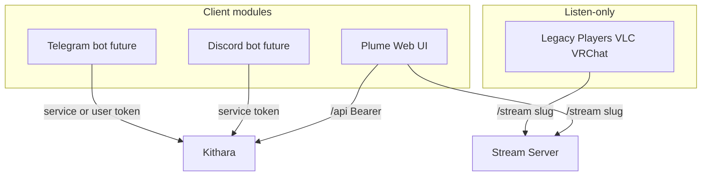

# Clients

Bardie's **user-facing surface is modular**. Client modules are separate deployable components that talk to Kithara's REST API — they are not baked into the core. Pick the interfaces that match how your community communicates.

| Module | Channel | MVP | Role |
|--------|---------|-----|------|
| **Plume** | Web | Yes | List/create Strunas, control playback, optional in-browser listen |
| **Discord bot** *(name TBD)* | Discord | Future | Play streams in voice channels; queue and source control |
| **Telegram bot** *(name TBD)* | Telegram | Future | Remote Struna control from chats |
| *More TBD* | — | Future | As convenient channels are identified |

**Legacy players** (VLC, VRChat, etc.) connect to `GET /stream/{slug}` for listen-only playback. They are not client modules — no REST control surface.

## Plume (web UI)

| Route | Role |
|-------|------|
| `/` | Main page — list/create Strunas (auth required) |
| `/player/{slug}` | Queue control; browser player **off by default**; PWA later |

Plume is the **reference client module** for MVP. It delegates login UI to auth adapters ([ADR 007](../adrs/007-auth-adapter-modules.md)).

## Discord bot *(name TBD)*

Discord integration for communities that live in voice channels.

Planned functionality:
- play Bardie streams directly in Discord voice channels
- select and control audio sources via Kithara API
- uses **service token** or per-guild credentials

## Telegram bot *(name TBD)*

Lightweight control surface for DJs who want to manage Strunas from Telegram.

Planned functionality:
- list active Strunas and now-playing
- play, skip, stop, queue tunes
- create or configure Strunas (permissions permitting)

## Client module contract

All client modules share the same integration pattern:

1. **Auth** — user login via adapter discovery, or service token for bots
2. **Control** — `POST /api/streams/{id}/play`, skip, stop, queue operations
3. **Listen** — optional; redirect users to `/stream/{slug}` or embed player (Plume only in MVP)

No gRPC required for client modules — REST only. Source and auth adapters use gRPC internally.

## OTel

Client modules export OTLP and show up in the same trace graph as Kithara ([ADR 008](../adrs/008-otel-observability.md)).

**Related:** [interfaces/uri-routing.md](../interfaces/uri-routing.md) · [domains/struna-access.md](struna-access.md)

**Read next:** [../interfaces/rest-api.md](../interfaces/rest-api.md)
