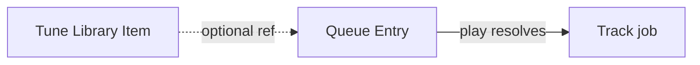

# Library and Tunes

A **Tune** (library item) is metadata + optional cache path for content that can be replayed (files, ytdl downloads). It is **not owned by a Struna**.

## Where tunes apply

| Source | Tune required? |
|--------|----------------|
| File module | Yes — cache path + metadata |
| YouTube module | Optional — may play by external ref only |
| Live input | No |

## Queue model

**QueueEntry** on a Struna holds play intent: **`module` slug + track ref** (and optional Tune id). At play time, Neck calls `StartTrack` on that source module; the module writes canonical PCM into the Struna’s session FIFO.

## Prototype artifacts

Current [Tune.cs](../../Models/Tune.cs) has conflicting `PlaylistId` FK and `List<Playlist> Playlists`. Target model uses a **shared library** + queue references — see [ADR 006](../adrs/006-stream-source-tune-data-model.md).

**Related:** [ADR 006](../adrs/006-stream-source-tune-data-model.md) · [playback-control.md](playback-control.md) · [glossary](../glossary.md)

**Read next:** [playback-control.md](playback-control.md)
