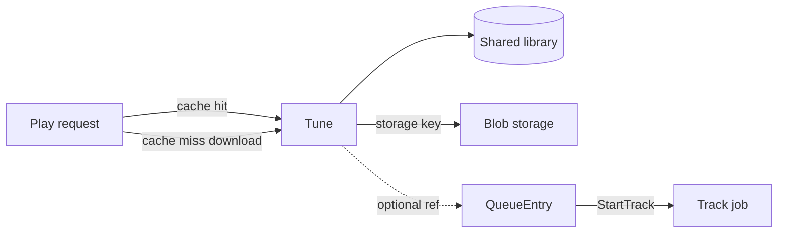

# Library and Tunes

> **Scope note:** This is a Kithara deep-dive. The shared library model, Tune persistence, and QueueEntry references belong here. **Where** bytes live is [storage.md](storage.md). Per-module download/upload behaviour (Magpie, Catbird, Starling) is sketched below for now because those repos have no architecture docs yet — it will move into each module’s docs later.

A **Tune** is a **shared library** item: metadata plus an optional **blob** of content that can be replayed (downloaded ytdl media, local files). It is **not owned by a Struna** — many Strunas can point at the same Tune through queue entries.

The library exists so the same piece of audio isn’t fetched or uploaded twice, and so history / “owned tracks” can hang off durable `User` rows without tying them to a single stream.

## What a Tune holds (sketch)

| Kind of data | Examples |
|--------------|----------|
| Identity | Internal id; source module slug; module-native external id (e.g. YouTube video id) |
| Metadata | Title, artist/uploader, duration, artwork URL |
| Blob | Opaque **storage key** (+ content type / size) resolved by the active [blob storage](storage.md) driver — not a host path |
| Provenance | Who first brought it in (user or module-managed user), when |

Exact schema is still target-level — see [ADR 006](../adrs/006-stream-source-tune-data-model.md) and [ADR 010](../adrs/010-blob-storage-backends.md). The invariant is: **one library**, referenced from queues, not buried inside a playlist or a single Struna.

## Where tunes apply

*(Module-specific rows — provisional until each source has its own docs.)*

| Source | How Tunes are used |
|--------|--------------------|
| **Magpie** (ytdl) | **Cache-first.** Look up an existing Tune by external id / URL; if the blob exists in storage, play from it. On miss, download, **create (or update) a Tune** with a storage key, then play. |
| **Catbird** (files) | Tune is required — metadata + storage key for uploaded / imported audio via blob storage. |
| **Starling** (external / continuous stream) | No Tune — input is a live URI / device stream, not a reusable library item. |

## Magpie: cache then download

*(Provisional Magpie deep dive — will move to Magpie docs.)*

Magpie always ends up with a Tune for content it can replay:

1. Client asks to play (or queue) a Magpie ref — video id, YouTube URL, or a search-result track ref.
2. Magpie (or Kithara library lookup on its behalf) finds an existing **Tune** for that external id.
3. **Cache hit** — blob present for the Tune’s storage key → decode from blob storage into the session FIFO; no network fetch.
4. **Cache miss** — download via ytdl → **put** into blob storage → **create or update the Tune** (metadata + storage key) → decode into the FIFO.

So Magpie does **not** “play by external ref only and skip the library.” External refs are how you *find or create* a Tune; the library is the durable record of what was already fetched.

## Queue model

**QueueEntry** on a Struna holds play intent: **`module` slug + track ref**, and optionally a **Tune id** when the library already knows the item.

At play time, Neck calls `StartTrack` on that source module with the track ref (and FIFO path). The module resolves cache vs download (Magpie) or blob vs live URI (Catbird / Starling) via the shared storage contract and writes canonical PCM into the Struna’s session FIFO.

One Struna can switch modules across queue entries — Magpie track, then Catbird file, then Magpie again — reusing the same FIFO and FFmpeg process.

## Ownership and sharing

- Tunes live in a **shared library**, not under a playlist or a single Struna.
- Users (including module-managed ones) can accumulate **owned / history** references to Tunes over time without tying those rows to one stream’s lifetime.
- Deleting a Struna must not delete its Tunes; other Strunas and history may still need them.
- Blob bytes live in [pluggable storage](storage.md); deleting a Tune implies deleting its blob (when no longer referenced — exact GC policy later).

## Prototype artifacts

Current [Tune.cs](../../Models/Tune.cs) has conflicting `PlaylistId` FK and `List<Playlist> Playlists`. Target model uses a **shared library** + queue references + storage keys — see [ADR 006](../adrs/006-stream-source-tune-data-model.md).

**Related:** [storage.md](storage.md) · [ADR 006](../adrs/006-stream-source-tune-data-model.md) · [ADR 010](../adrs/010-blob-storage-backends.md) · [playback-control.md](playback-control.md) · [source-modules.md](source-modules.md) · [glossary](../glossary.md)

**Read next:** [storage.md](storage.md)
