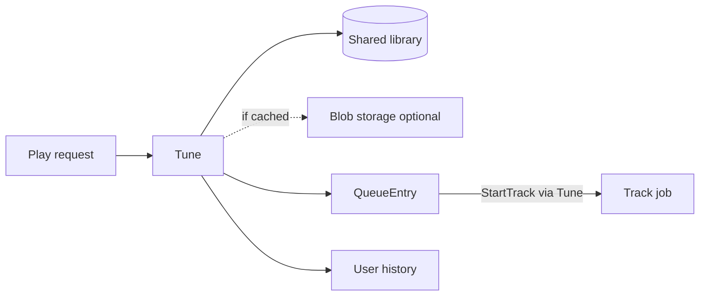

# Library and Tunes

> **Scope note:** This is a Kithara deep-dive. The shared library model, Tune persistence, queue, and history belong here. **Where** optional bytes live is [storage.md](storage.md). Magpie download/cache-hit behaviour: [Magpie architecture](https://github.com/Bardie-radio/magpie/tree/main/docs/architecture).

A **Tune** is the **shared library unit**: one row that can serve as a **queue item**, a **history item**, and (when bytes exist) a **cache item**. It is **not owned by a Struna** — many Strunas and users can point at the same Tune.

The library exists so playable intents are reusable: re-queue from history by Tune id, share cache across Strunas when a blob exists, and keep one model across Magpie, Catbird, and Starling.

## What a Tune holds (sketch)

| Kind of data | Required? | Examples |
|--------------|-----------|----------|
| Identity | Yes | Internal id; source **module** slug; module-native **external id** (YouTube video id, file id, **stream URI**, …) |
| Metadata | Optional / sparse | Title, artist/uploader, duration, artwork — may be empty for raw streams |
| Blob | **Optional** | Opaque **storage key** (+ content type / size) when cacheable bytes exist — not a host path |
| Provenance | Yes | Who first brought it in (durable / managed user), when |

**Invariant:** blob/cache is a property of some Tunes, not a requirement for being a Tune. Exact schema: [ADR 006](../adrs/006-stream-source-tune-data-model.md) · [ADR 010](../adrs/010-blob-storage-backends.md).

## Where tunes apply

| Source | Tune shape |
|--------|------------|
| **Magpie** (ytdl) | Rich metadata + **cache-first** blob — [Magpie docs](https://github.com/Bardie-radio/magpie/blob/main/docs/architecture/02-contracts.md) |
| **Catbird** (files) | Metadata + storage key (upload/import) — [Catbird planned](https://github.com/Bardie-radio/catbird/blob/main/docs/architecture/01-planned-role.md) |
| **Starling** (external / continuous stream) | Sparse Tune: module + **URI as external id**, little/no metadata, **no** blob. Still in library + history so the user replays by Tune id without re-typing the URI — [Starling planned](https://github.com/Bardie-radio/starling/blob/main/docs/architecture/01-planned-role.md) |

## Queue, history, cache

| Role | How |
|------|-----|
| **Queue** | `QueueEntry` on a Struna points at a **Tune id** (order / position on the Struna) |
| **History** | User ↔ Tune references (durable / managed); survives Struna delete |
| **Cache** | Optional storage key on the Tune; Magpie/Catbird fill it; Starling leaves it null |

First play of a new Magpie URL or Starling URI **creates/updates a Tune** in the library (`Library.EnsureTune`), then queues that Tune. Later plays from history use the Tune id.

At play time, Neck loads the Tune, calls `StartTrack` on its module with the resolved track ref (and session audio endpoint). The module uses blob (if any) or live external id (URI) and writes canonical PCM.

One Struna can switch modules across queue entries — Magpie Tune, then Catbird Tune, then Starling Tune — reusing the same session FIFO and FFmpeg process.

## Ownership and sharing

- Tunes live in a **shared library**, not under a playlist or a single Struna.
- Deleting a Struna must not delete its Tunes; other Strunas and history may still need them.
- Blob bytes live in [pluggable storage](storage.md); deleting a Tune deletes its blob only when a key exists and GC allows (exact policy later).

## Module RPC

Modules dial Kithara [EnsureTune](../interfaces/grpc-library.md) (**v0.1 draft**) after putting cache bytes. Upsert key: `module_slug` + `external_id`.

## Prototype artifacts

Current [Tune.cs](../../Models/Tune.cs) has conflicting `PlaylistId` FK and `List<Playlist> Playlists`. Target model: **shared library Tune** (+ optional storage key) referenced by queue and history — see [ADR 006](../adrs/006-stream-source-tune-data-model.md).

**Related:** [storage.md](storage.md) · [grpc-library](../interfaces/grpc-library.md) · [ADR 006](../adrs/006-stream-source-tune-data-model.md) · [ADR 010](../adrs/010-blob-storage-backends.md) · [playback-control.md](playback-control.md) · [source-modules.md](source-modules.md) · [glossary](../glossary.md)

**Read next:** [storage.md](storage.md)
