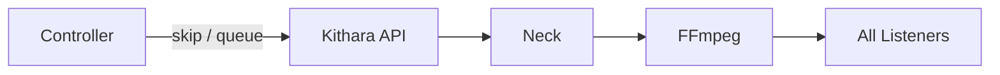

# Playback Control

Bardie uses **live broadcast** semantics ([ADR 001](../adrs/001-broadcast-sync-model.md)): one encoder per Struna; control actions affect everyone tuned in.

## Operations

| Action | Effect |
|--------|--------|
| **Play** | Resolve queue entry → `StartTrack` on module → module writes PCM to session FIFO |
| **Skip** | `StopTrack` current job → play next queue entry (FFmpeg stays up) |
| **Pause** | Keep FFmpeg + FIFO + slug; Neck feeds silence |
| **Stop** | Kill FFmpeg, close FIFO session, **free slug**; Stream Server returns 404 |
| **Delete** | Remove Struna row (stop first if alive) |
| **Queue add** | Append QueueEntry (`module` slug + track ref); may take effect on next track |

Informal **prewarm**: the next module may buffer ahead; no MVP `PrepareTrack` RPC.

## Now playing

- ICY `StreamTitle` updated on Stream Server
- REST `GET /api/streams/{id}/now-playing` for clients
- Optional future: SSE/WebSocket events

## Permissions

Controlled by Struna **control access** mode — see [struna-access.md](struna-access.md). Guest codes are Kithara-owned Struna secrets.

**Related:** [ADR 001](../adrs/001-broadcast-sync-model.md) · [struna-access.md](struna-access.md) · [streams.md](streams.md) · [source-instances.md](source-instances.md)

**Read next:** [clients.md](clients.md)
