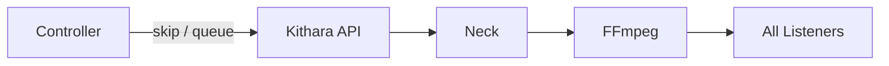

# Playback Control

Bardie uses **live broadcast** semantics ([ADR 001](../adrs/001-broadcast-sync-model.md)): one encoder per Struna; control actions affect everyone tuned in.

## Operations

| Action | Effect |
|--------|--------|
| **Play** | Resolve queue head → create instance → attach encoder |
| **Skip** | Stop current instance → play next queue entry |
| **Stop** | Tear down encoder; Stream Server returns 404 |
| **Queue add** | Append QueueEntry; may take effect on next track |

## Now playing

- ICY `StreamTitle` updated on Stream Server
- REST `GET /api/streams/{id}/now-playing` for Plume
- Optional future: SSE/WebSocket events

## Permissions

Controlled by Struna **control access** mode — see [struna-access.md](struna-access.md).

**Read next:** [clients.md](clients.md)
