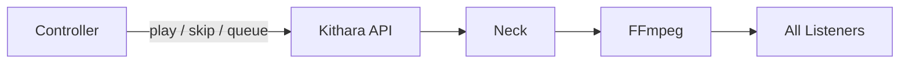

# Playback Control

Bardie uses **live broadcast** semantics ([ADR 001](../adrs/001-broadcast-sync-model.md)): one encoder per Struna; control actions affect everyone tuned in.

## Operations

| Action | Effect |
|--------|--------|
| **Play** (empty) | Unpause — clear silence feeder; keep current job / queue head |
| **Play** (body) | Start a **specific** track now (Tune id, search-result ref → Tune, or native URI/id → create Tune) |
| **Quickplay** | Search → play first hit (source priority / user default + fallbacks) |
| **Skip** | `StopTrack` current job → play next queue entry (FFmpeg stays up) |
| **Pause** | Keep FFmpeg + FIFO + slug; Neck feeds silence |
| **Delete** | Kill FFmpeg, close FIFO, **free slug**, remove Struna — one teardown (no separate “stop”) |
| **Queue** | Append a specific track (same body shapes as play) |
| **Quickqueue** | Quick-search → append first hit |

Informal **prewarm**: the next module may buffer ahead; no MVP `PrepareTrack` RPC.

Endpoint sketch and payloads: [rest-api](../interfaces/rest-api.md).

## Now playing

- ICY `StreamTitle` updated on Stream Server
- REST `GET /api/streams/{id}/now-playing` for clients
- Optional future: SSE/WebSocket events

## Permissions

Controlled by Struna **control access** mode — see [struna-access.md](struna-access.md). Protected control uses a short **guest code** exchanged for an **ephemeral guest user** + JWT (not the code on every request).

**Related:** [ADR 001](../adrs/001-broadcast-sync-model.md) · [struna-access.md](struna-access.md) · [streams.md](streams.md) · [source-instances.md](source-instances.md)

**Read next:** [clients.md](clients.md)
