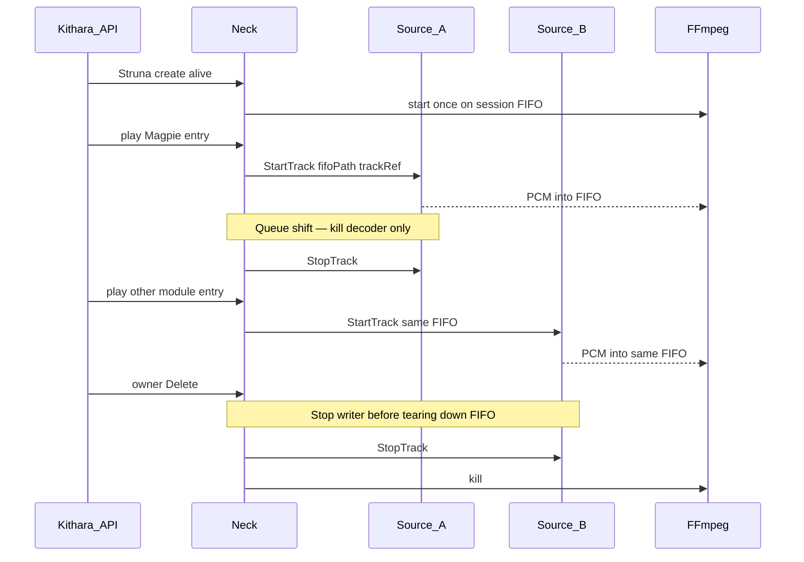

# Source sessions and track jobs

Audio for a Struna uses a **long-lived session** (FFmpeg + Kithara-owned FIFO) and short-lived **track jobs** on source modules. Different modules can take turns on one Struna. On teardown, Neck **stops the track job first**, then kills FFmpeg / closes the FIFO so the source never writes into a gone socket.

## Lifetimes

| Piece | Lifetime | On queue shift |
|-------|----------|----------------|
| FFmpeg / Struna Encoder | Entire Struna alive period | **Never kill** (restarting breaks many ICY players) |
| Session FIFO (Kithara-owned) | Same | **Reuse** |
| Track job (decode) | One queue item | **StopTrack → StartTrack** on possibly another module |

## Silence

While alive with no module writer, Neck’s **silence feeder** writes to the FIFO so FFmpeg never sees a fatal EOF (idle between tracks, pause, empty queue).

## Informal prewarm

Modules may buffer the next track before their turn. No MVP `PrepareTrack` RPC.

## Isolation

Track jobs stay **isolated per Struna** — same track on two Strunas means two jobs ([ADR 005](../adrs/005-isolated-instance-per-stream.md)). No sharing FIFOs across Strunas.

## Canonical PCM

MVP default internal format: **s16le / 48 kHz / stereo**. Listener encode (MP3/ICY) is separate — see encode modes on Struna create.

## gRPC surface

See [interfaces/grpc-source-module.md](../interfaces/grpc-source-module.md): `StartTrack`, `StopTrack`, `Search`, `TrackStatus`, `Health`, `Register`.

## Replaces prototype approach

Prototype Neck concatenated playlist files in FFmpeg ([spike notes](../spike/prototype-neck-ffmpeg.md)). Target: modules write PCM into a Neck-owned FIFO while FFmpeg stays up for the Struna life.

**Related:** [ADR 004](../adrs/004-source-instance-socket-audio-plane.md) · [domains/streams.md](streams.md) · [interfaces/streaming-stack.md](../interfaces/streaming-stack.md)

**Read next:** [streams.md](streams.md)
