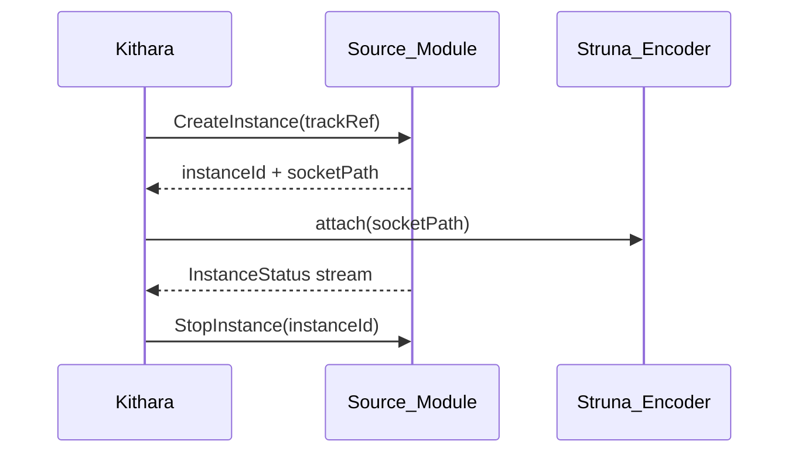

# Source Instances

The **source instance** is Bardie's core audio abstraction — an ephemeral playback handle created by a source module.

## Lifecycle

| Phase | Action | Owner |
|-------|--------|-------|
| Create | `CreateInstance` gRPC | Module spawns decode pipeline + socket |
| Attach | FFmpeg reads socket | Neck / Struna Encoder |
| Detach | Stop reading socket | Neck (instance may survive) |
| Stop | `StopInstance` | Module tears down resources |

## Properties

- **Isolated per Struna** — same track on two Strunas = two instances ([ADR 005](../adrs/005-isolated-instance-per-stream.md)).
- **Socket endpoint** — Unix domain socket path returned in gRPC response.
- **Parallelism** — module enforces resource limits; Kithara tracks N active instances.

## gRPC surface

See [interfaces/grpc-source-module.md](../interfaces/grpc-source-module.md): `CreateInstance`, `StopInstance`, `Search`, `InstanceStatus`, `Health`.

## Replaces prototype approach

Prototype [Neck.cs](../../Services/Neck.cs) concatenated playlist files in FFmpeg. Target architecture feeds **one instance socket** per active Struna.

**Related:** [ADR 004](../adrs/004-source-instance-socket-audio-plane.md) · [domains/streams.md](streams.md)

**Read next:** [streams.md](streams.md)
