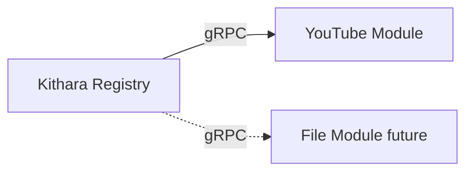

# Source Modules

**Source modules** are separate containers that register capabilities with Kithara and create **source instances** on demand.

## Registration

On startup, module calls `Register` with:

- Module ID (`bardie.source.youtube`)
- Capabilities: `search`, `play`, `live-input`, …
- gRPC endpoint address

Kithara **Module Registry** tracks health and routes commands.

## MVP module

| Repo | Capability |
|------|------------|
| `bardie-source-youtube` (TBD name) | Search + play via ytdl |

## Contract

[interfaces/grpc-source-module.md](../interfaces/grpc-source-module.md)

## Observability

Must export OTLP and propagate W3C trace context — see [operations/observability.md](../operations/observability.md).

**Related:** [domains/source-instances.md](source-instances.md) · [ADR 003](../adrs/003-grpc-control-plane.md)

**Read next:** [auth-adapters.md](auth-adapters.md)
