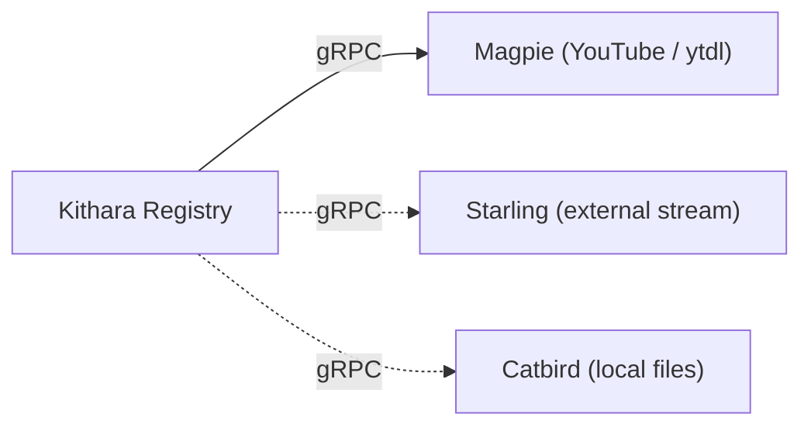

# Source Modules

Solid edge = MVP; dashed = later. **Source modules** are separate containers that register with Kithara and run **track jobs** that write canonical PCM into a Struna’s session FIFO.

## Registration

On startup, module calls `Register` with:

- **Slug** (lowercase codename, e.g. `magpie`) — operator may override via Compose env when community modules collide
- **Capabilities** — what this module supports (see below)
- gRPC endpoint address
- **Join secret** from Compose / Kithara config (same network is not enough)

Kithara **Module Registry** tracks health and routes `Search` / `StartTrack` / `StopTrack` (and pause when advertised).

### Capabilities

Flags the module advertises at registration so Kithara and clients know which RPCs and control verbs apply. They are **not** module type names.

| Capability | Meaning |
|------------|---------|
| `search` | Module implements `Search` (clients can query it, alone or in fan-out) |
| `play` | Module can run track jobs (`StartTrack` / `StopTrack`) writing PCM to the session FIFO |
| `pause` | An active track job can **pause and resume** without tearing down the job |

Modules **without** `pause` (Starling) only support a full **stop** of the track job — there is no mid-job freeze. That is the main behavioral difference for an external/live stream source versus Magpie or Catbird: the input is continuous.

Exact capability strings stay sketch-level in the [gRPC contract](../interfaces/grpc-source-module.md); the invariant is advertise what you can do, don’t invent source-type labels.

## Modules

| Codename | Role | MVP |
|----------|------|-----|
| **Magpie** | YouTube / ytdl — search + play; **cache-first Tunes**, download-and-create Tune on miss | Yes |
| **Starling** | External / local stream — re-broadcast direct audio input; no mid-job pause | Future |
| **Catbird** | Local files — play uploaded / local audio | Future |

Image/Compose: `magpie`, `starling`, `catbird`. OTel: `bardie.source.<slug>`.

## Search

Kithara exposes two client-facing search modes; both map to the module `Search` RPC when the source advertises `search`:

| Client mode | REST (sketch) | What the module sees |
|-------------|----------------|----------------------|
| **Quicksearch** | `GET …/quicksearch?q=…` (+ optional `module`) | Plain-text / **title-only** query; fan-out if `module` omitted |
| **Regular search** | `POST …/search` | Structured fields from the module’s advertised schema (always includes `title`) |

Omit module slug to fan out across registered sources that advertise `search`. Queue / play always store the winning **module slug + track ref**.

### Regular search fields

At **Register**, searchable modules advertise a **search field schema** so clients can build a full search form. Contributor expectations:

| Field | Expectation |
|-------|-------------|
| `title` | **Mandatory** — alone is what quicksearch sends |
| `artist` | Encouraged when the source has artists |
| `owner` | Encouraged when useful (e.g. Magpie: uploader / first querier) |

### Plain-text fallback

If a text (quicksearch / title-only) search returns nothing, try interpreting the query as a **native id / URI** before returning empty (Magpie: video id or YouTube URL). Starling has no search surface — its stream URI goes on **play**, not search.

## Contract

[interfaces/grpc-source-module.md](../interfaces/grpc-source-module.md)

## Observability

Must export OTLP and propagate W3C trace context — see [operations/observability.md](../operations/observability.md).

**Related:** [domains/source-instances.md](source-instances.md) · [ADR 003](../adrs/003-grpc-control-plane.md) · [ADR 004](../adrs/004-source-instance-socket-audio-plane.md)

**Read next:** [auth-adapters.md](auth-adapters.md)
