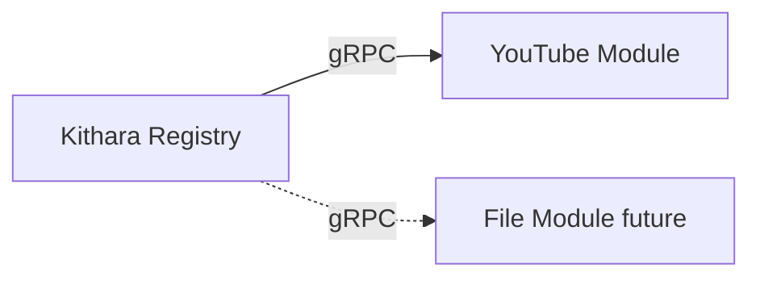

# Source Modules

**Source modules** are separate containers that register with Kithara and run **track jobs** that write canonical PCM into a Struna’s session FIFO.

## Registration

On startup, module calls `Register` with:

- **Slug** (human id, e.g. `youtube`) — operator may override via Compose env when community modules collide
- Capabilities: `search`, `play`, `live-input`, …
- gRPC endpoint address
- **Join secret** from Compose env (same network is not enough)

Kithara **Module Registry** tracks health and routes `Search` / `StartTrack` / `StopTrack`.

## MVP module

| Role | Notes |
|------|-------|
| YouTube source *(name TBD)* | Search + play via ytdl; writes PCM to Kithara-owned FIFO path |

## Search

Clients may pass a module slug or omit it for fan-out across registered sources. Queue entries always store the winning **module slug + track ref**.

## Contract

[interfaces/grpc-source-module.md](../interfaces/grpc-source-module.md)

## Observability

Must export OTLP and propagate W3C trace context — see [operations/observability.md](../operations/observability.md).

**Related:** [domains/source-instances.md](source-instances.md) · [ADR 003](../adrs/003-grpc-control-plane.md) · [ADR 004](../adrs/004-source-instance-socket-audio-plane.md)

**Read next:** [auth-adapters.md](auth-adapters.md)
