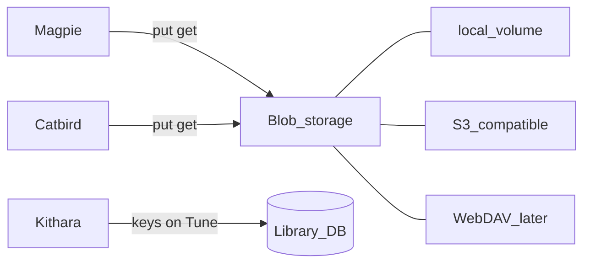

# Blob storage

> **Scope note:** This is a Kithara deep-dive into **where library bytes live**. Magpie/Catbird download and upload *behaviour* stays provisional in [library-and-tunes](library-and-tunes.md) until those modules have their own docs; the durable storage contract lives here.

Kithara owns **blob storage** for the shared library: one operator-configured backend, opaque **storage keys** on each Tune. Magpie (cache) and Catbird (uploads) put/get through that shared contract — not each module inventing its own bucket.

## Drivers

| Driver | When | Notes |
|--------|------|-------|
| **Local filesystem** | **MVP default** | Container volume; override root with `BARDIE_STORAGE_PATH` |
| **S3-compatible** | Planned / v0.2 | One driver: AWS S3, MinIO, Garage, Cloudflare R2, Backblaze B2, … |
| **WebDAV** | Later | Homelab NAS / Nextcloud without standing up MinIO |

NFS/SMB shares are **not** a separate driver — mount the share and point `BARDIE_STORAGE_PATH` at it under the local driver.

## What lives here

| In blob storage | Not in blob storage |
|-----------------|---------------------|
| Magpie download cache (ytdl media) | Session FIFOs (local ephemeral) |
| Catbird uploaded / imported files | FFmpeg scratch |
| Optional later: artwork, other library blobs | Database, secrets |

Library files are **not** served on the public edge — listeners still use ICY `GET /stream/{slug}`.

## Storage keys vs paths

A Tune does **not** store a host filesystem path as its durable cache pointer. It stores an opaque **storage key** (plus content type / size). The active driver resolves the key to a local file, S3 object, or WebDAV resource.

That way switching from local volume to MinIO (or the reverse) does not rewrite library semantics — only driver config.

## Operator config (sketch)

One backend for the whole stack, configured **once on Kithara** (Compose env / secrets). Source modules do **not** get a parallel `BARDIE_STORAGE_*` surface — they put/get through Kithara (storage API and/or discovery of how to reach the shared backend).

| Variable | Role |
|----------|------|
| `BARDIE_STORAGE_DRIVER` | `local` (MVP) \| `s3` \| later `webdav` |
| `BARDIE_STORAGE_PATH` | Local driver root (volume or NFS/SMB mount) — on **Kithara** |
| `BARDIE_STORAGE_S3_*` | Endpoint, bucket, region, credentials (S3-compatible) — on **Kithara** |

See [configuration](../operations/configuration.md) and [ADR 010](../adrs/010-blob-storage-backends.md).

## Access pattern

Modules **dial Kithara** and put/get (stream) by storage key through a **thin storage RPC/API on Kithara**. Kithara’s driver interface (local / S3 / …) is the only place that knows the backend. Keep that hop as thin as practical — library writes are bulky; avoid extra copies and chatty round-trips where the driver allows.

Docs lock **Kithara-configured shared backend + opaque keys + module→Kithara storage calls** — not per-module independent buckets or duplicated `BARDIE_STORAGE_*` on Magpie/Catbird, and not a new public path for raw library files.

Exact streaming RPC shapes land with Phase 0 proto freeze.

**Related:** [library-and-tunes.md](library-and-tunes.md) · [ADR 006](../adrs/006-stream-source-tune-data-model.md) · [ADR 010](../adrs/010-blob-storage-backends.md) · [operations/deployment.md](../operations/deployment.md)

**Read next:** [library-and-tunes.md](library-and-tunes.md)
