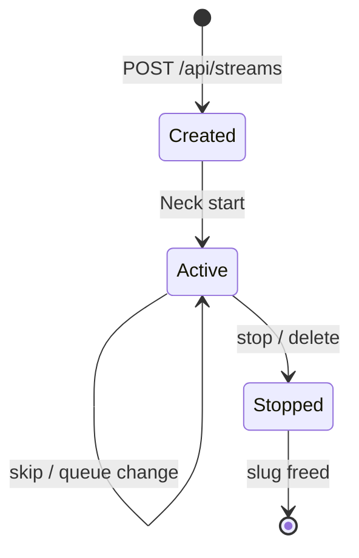

# Streams (Struna)

A **Struna** (stream) is a named broadcast channel managed by **Neck** inside Kithara.

## Identity

| Field | Purpose |
|-------|---------|
| `Id` | Internal GUID — API paths, DB, traces |
| `Slug` | User-chosen URL name — `/stream/{slug}`, `/player/{slug}` |
| `Title` | Display name |

**Slug rules:** lowercase alphanumeric + hyphens; unique among **active** Strunas; reserved names blocked (`api`, `stream`, `admin`); HTTP 409 on conflict.

## Neck service responsibilities

1. Start/stop Struna encoder (FFmpeg per active stream)
2. Attach/detach source instance sockets
3. Register Stream Server endpoint `/stream/{slug}`
4. Push now-playing metadata to Stream Server for ICY injection
5. Monitor instance health via gRPC status stream

Neck lives **inside Kithara** — not a separate container. See [glossary](../glossary.md).

## Target schema fields

- `PlaybackAccess`: public | protected | private
- `ControlAccess`: private | protected
- `ListenToken`, `GuestCode` (nullable)
- Active `SourceInstanceId`, queue entries

**Related:** [domains/struna-access.md](struna-access.md) · [ADR 006](../adrs/006-stream-source-tune-data-model.md) · [spike/prototype-neck-ffmpeg.md](../spike/prototype-neck-ffmpeg.md)

**Read next:** [struna-access.md](struna-access.md)
