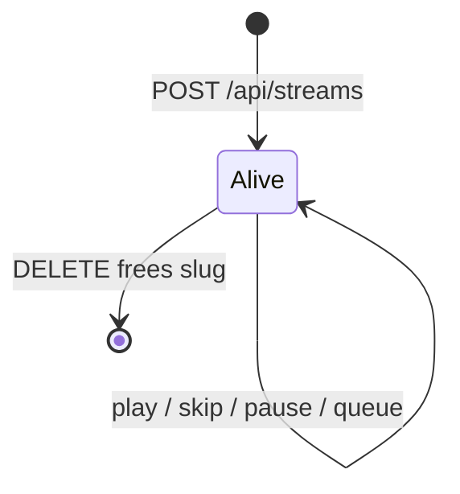

# Streams (Struna)

A **Struna** (stream) is a named broadcast channel managed by **Neck** inside Kithara.

## Identity

| Field | Purpose |
|-------|---------|
| `Id` | Internal GUID — API paths, DB, traces |
| `Slug` | User-chosen URL name — `/stream/{slug}`, `/player/{slug}` |
| `Title` | Display name |

**Slug rules:** lowercase alphanumeric + hyphens; unique among **alive** Strunas; HTTP 409 on conflict. Listen URLs live under `/stream/{slug}` — that path prefix already isolates them from `/api/…` and `/player/…`, so we do **not** maintain a reserved-name denylist for route collisions (a Struna may be named `api` or `player`).

**Alive from create (two layers):**

| Layer | When | Means |
|-------|------|--------|
| **Control-alive** | Now (Phase 3+) | Slug reserved, session FIFO created, guest code (+ listen token when playback is protected). Play/queue/skip work against source modules writing PCM into the FIFO |
| **Encode-alive** | Phase 4 | Silence feeder + FFmpeg supervisor reading that FIFO for continuous encoded output |

Until Phase 4, create is control-alive only — there is no encoder yet, so listeners cannot hear `/stream/{slug}`. **DELETE** (or silent **cleanup**) stops the track job, closes the FIFO, destroys guests, and **frees the slug** — there is no separate stop endpoint.

## Neck service responsibilities

1. Start FFmpeg once per alive Struna; keep it running until delete/cleanup
2. Own the per-Struna **session FIFO**; feed silence when no module is writing
3. `StartTrack` / `StopTrack` on source modules (multi-source via module slug)
4. Register Stream Server endpoint `/stream/{slug}`
5. Push now-playing metadata for ICY injection
6. Monitor track-job health via gRPC status stream

Neck lives **inside Kithara** — not a separate container. FFmpeg process ownership belongs to a hosted supervisor (not a single HTTP request scope) — see [internal structure](../overview/02-internal-structure.md).

## Target schema fields

- `PlaybackAccess`: public | protected | private
- `ControlAccess`: private | protected
- `OwnerUserId` + grant list for private control ([auth ACL](../interfaces/auth.md))
- `ListenToken`, `GuestCode` (nullable; owned by Kithara) — guest code is exchange-only; each exchange creates an ephemeral guest user + JWT
- Active track job + queue entries (**Tune id** per slot; module resolved from Tune)
- Listener encode quality is **operator/FFmpeg config** for MVP

## Cleanup (planned)

Operator-configurable: auto-**delete** Strunas that stay silent longer than a threshold (frees slug).

**Related:** [domains/struna-access.md](struna-access.md) · [ADR 006](../adrs/006-stream-source-tune-data-model.md) · [domains/source-instances.md](source-instances.md)

**Read next:** [struna-access.md](struna-access.md)
