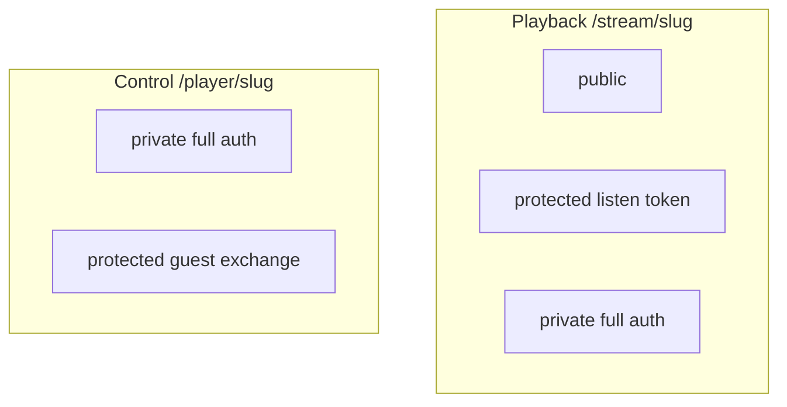
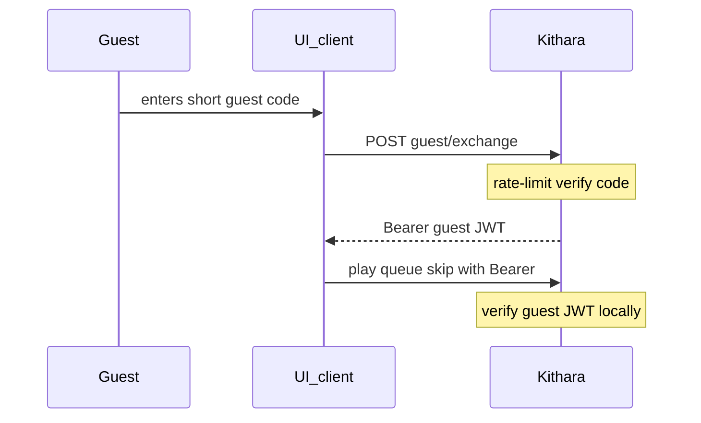

# Struna Access

Playback and control access are **fully independent** per Struna.

## Playback (listening)

| Mode | Legacy players | Web / Plume |
|------|----------------|-------------|
| **public** | `/stream/lofi` | Works |
| **protected** | `/stream/lofi?token=...` (MVP) | Session/cookie |
| **private** | Not compatible (no OIDC in VLC) | Full auth |

### Protected token delivery

| Method | Example | MVP |
|--------|---------|-----|
| Query param | `/stream/lofi?token=abc` | **Yes** |
| HTTP Basic | token as password | v0.2 eval |
| Path segment | `/stream/lofi/abc` | v0.2 eval |

Token generated at creation (**Kithara-owned** Struna secret); owner can rotate. Query params may appear in logs — see [ADR 009](../adrs/009-struna-access-and-routing.md). Listen tokens stay query/Basic secrets for legacy players — **no** Bearer exchange (players cannot do that well).

## Control (queue / skip)

| Mode | Mechanism |
|------|-----------|
| **private** | Authenticated users with control permission (user/login JWT or static per-user credentials) |
| **protected** | Short **guest code** exchanged once for a **guest control JWT** (Bearer) |
| **public** | **Not supported** |

### Protected control: guest code → guest JWT

Do **not** send the short guest code on every API call — it is brute-forceable and sticky in logs/history.

| Piece | Role |
|-------|------|
| **Guest code** | Short, human-shareable, Kithara-owned; used **only** at exchange (rate-limited) |
| **Guest control JWT** | Kithara-signed capability token (`iss=kithara`, `struna_id`, `scope` ≈ `stream:control`, `exp`, optional `jti`); Bearer on control endpoints for **that Struna only** |

Guests are **not** Users — no auth-module binding. Party DJ is a capability grant, not an account.

**Security:** rate-limit exchange; short JWT TTL; owner **rotates** the guest code (bump epoch / invalidate outstanding guest JWTs). Endpoint: [rest-api](../interfaces/rest-api.md).

## Example combinations

| Playback | Control | Use case |
|----------|---------|----------|
| public | private | Open radio; owner DJs |
| public | protected | Party — anyone listens; guests exchange code then queue |
| protected | protected | Listen token URL + guest exchange for control |
| private | private | Fully locked |

## Bots / static clients

**Module-managed user** credentials (day-to-day control) plus module **join secret** for admin only — see [clients](clients.md). For listen-only bots, a **protected** Struna with a known listen token also works.

**Related:** [interfaces/http-stream-output.md](../interfaces/http-stream-output.md) · [interfaces/auth.md](../interfaces/auth.md) · [ADR 009](../adrs/009-struna-access-and-routing.md)

**Read next:** [source-modules.md](source-modules.md)
