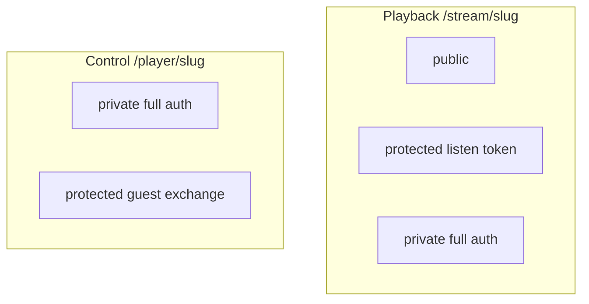

# Struna Access



Playback and control access are **fully independent** per Struna.

## Playback (listening)

| Mode | Legacy players | Web / Plume |
|------|----------------|-------------|
| **public** | `/stream/lofi` | Works |
| **protected** | `/stream/lofi?token=...` (MVP) | Session/cookie |
| **private** | Not compatible (no OIDC in VLC) | Full auth |

### Protected token delivery

| Method | Example | MVP |
|--------|---------|-----|
| Query param | `/stream/lofi?token=abc` | **Yes** |
| HTTP Basic | token as password | v0.2 eval |
| Path segment | `/stream/lofi/abc` | v0.2 eval |

Token generated at creation (**Kithara-owned** Struna secret); owner can rotate. Query params may appear in logs — see [ADR 009](../adrs/009-struna-access-and-routing.md). Listen tokens stay query/Basic secrets for legacy players — **no** Bearer exchange (players cannot do that well).

## Control (queue / skip)

| Mode | Mechanism |
|------|-----------|
| **private** | Authenticated **durable** or **managed** users with control permission |
| **protected** | Short **guest code** → Kithara creates an **ephemeral guest user** + mints JWTs for that user |
| **public** | **Not supported** |

### REST discovery lists

| Path | Filter |
|------|--------|
| `GET /api/streams/listen` | Principal may listen (public for all; protected/private → owner **or** grant) |
| `GET /api/streams/control` | Principal may DJ (owner **or** grant **or** protected-control ephemeral guest for that Struna) |

Today’s ACL is owner + grant (+ guest for protected control). Managed-user permission ceiling and grant CRUD API deepen later — stub comments in code say **full auth on Phase 6**. Listen-token holders are gated on `/stream/{slug}` (Phase 5), not via these lists.

### Protected control: guest code → ephemeral guest user

Do **not** send the short guest code on every API call — it is brute-forceable and sticky in logs/history.

One guest code is generated **per Struna** (owner can rotate). Each successful exchange creates a **new ephemeral guest user** bound to that Struna. Kithara **mints** access (+ refresh) JWTs for that user. When the Struna is deleted/cleaned up, Kithara destroys all ephemeral guest users created for that Struna.

**Rotating** the guest code **only blocks new joins**. Existing ephemeral guests keep their sessions until the Struna is deleted (or their JWT refresh window ends without a valid path — still tied to Struna life for destruction of the user row).

```mermaid
sequenceDiagram
  participant Guest
  participant Client as UI_client
  participant Kithara
  Guest->>Client: enters short guest code
  Client->>Kithara: POST guest/exchange
  Note over Kithara: rate-limit verify code
  Note over Kithara: create ephemeral guest user for this joiner
  Kithara-->>Client: Bearer JWT + refresh for that user
  Client->>Kithara: play queue skip with Bearer
  Note over Kithara: verify Kithara-minted JWT; ACL = this Struna
  Note over Kithara: on Struna DELETE — destroy ephemeral guests
```

| Piece | Role |
|-------|------|
| **Guest code** | Short, human-shareable, Kithara-owned; used **only** at exchange (rate-limited); one per Struna until rotated |
| **Ephemeral guest user** | Kithara-owned `User` row (no auth-module binding); one **per joiner**; destroyed with the Struna |
| **Guest JWT (+ refresh)** | Kithara-signed credentials for that ephemeral user; refreshable until Struna teardown |

Party DJ is still not a durable account — but it **is** a real row in Kithara’s user table for ACL, search-cache ownership, and refresh. See [glossary](../glossary.md) for naming vs **managed users**.

**Security:** rate-limit exchange; JWT TTL + refresh; owner **rotates** the guest code to stop **new** joiners (existing guests unaffected until Struna delete). Endpoint: [rest-api](../interfaces/rest-api.md).

## Example combinations

| Playback | Control | Use case |
|----------|---------|----------|
| public | private | Open radio; owner DJs |
| public | protected | Party — anyone listens; guests exchange code then queue |
| protected | protected | Listen token URL + guest exchange for control |
| private | private | Fully locked |

## Bots / static clients

**Managed users** (day-to-day control) plus module **join secret** for admin only — see [clients](clients.md). For listen-only bots, a **protected** Struna with a known listen token also works.

**Related:** [interfaces/http-stream-output.md](../interfaces/http-stream-output.md) · [interfaces/auth.md](../interfaces/auth.md) · [ADR 009](../adrs/009-struna-access-and-routing.md)

**Read next:** [source-modules.md](source-modules.md)
