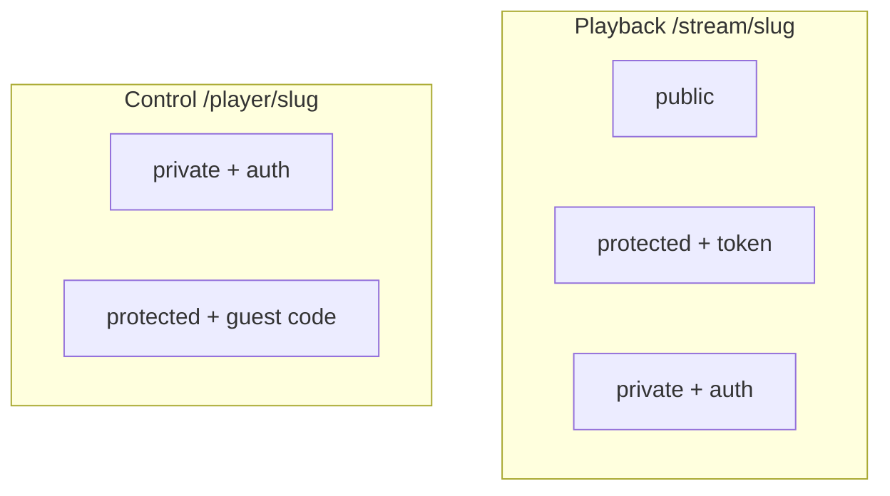

# Struna Access

Playback and control access are **fully independent** per Struna.

## Playback (listening)

| Mode | Legacy players | Web / Plume |
|------|----------------|-------------|
| **public** | `/stream/lofi` | Works |
| **protected** | `/stream/lofi?token=...` (MVP) | Session/cookie |
| **private** | Not compatible (no OIDC in VLC) | Full auth |

### Protected token delivery

| Method | Example | MVP |
|--------|---------|-----|
| Query param | `/stream/lofi?token=abc` | **Yes** |
| HTTP Basic | token as password | v0.2 eval |
| Path segment | `/stream/lofi/abc` | v0.2 eval |

Token generated at creation; owner can rotate. Query params may appear in logs — see [ADR 009](../adrs/009-struna-access-and-routing.md).

## Control (queue / skip)

| Mode | Mechanism |
|------|-----------|
| **private** | Authenticated users with control permission |
| **protected** | Short **guest code** entered on `/player/{slug}` |
| **public** | **Not supported** |

## Example combinations

| Playback | Control | Use case |
|----------|---------|----------|
| public | private | Open radio; owner DJs |
| public | protected | Party — anyone listens, guests queue with code |
| protected | protected | Token URL + guest code |
| private | private | Fully locked |

## Bots

Service tokens + permissions, or **protected** Strunas with known listen token.

**Related:** [interfaces/http-stream-output.md](../interfaces/http-stream-output.md) · [interfaces/auth.md](../interfaces/auth.md)

**Read next:** [source-modules.md](source-modules.md)
