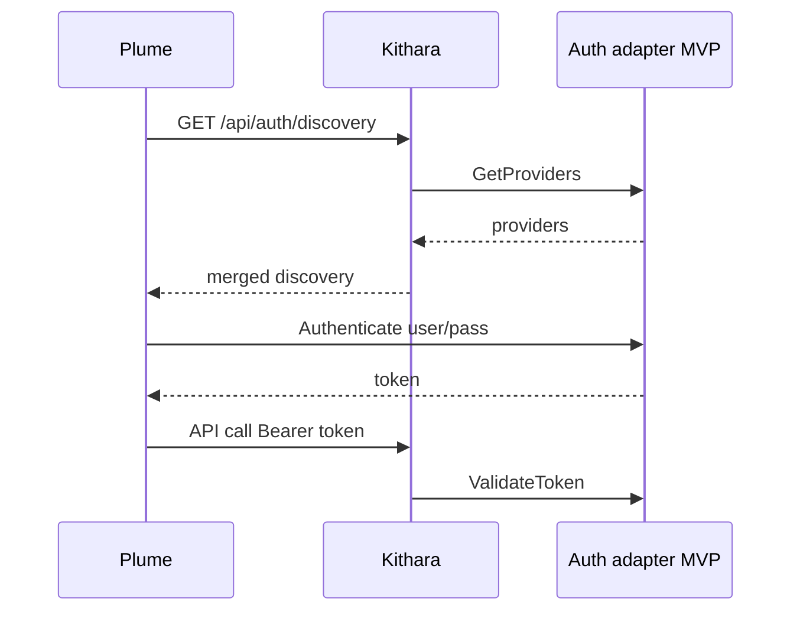

# Auth API and Permissions

## Discovery

`GET /api/auth/discovery` — Kithara auth orchestrator merges `GetProviders()` from all registered adapters.

MVP response includes one `form_schema` provider from the login+password adapter (module name TBD).

## Permission matrix (sketch)

| Action | Typical role |
|--------|--------------|
| Create Struna | `stream:create` |
| Control playback | `stream:control` on Struna |
| Listen (private) | `stream:listen` |
| Register source module | `admin:modules` |
| Register auth adapter | `admin:auth` |

Roles returned by `ValidateToken` from adapter or service token config.

## Service tokens

Long-lived tokens in Kithara env for bots/modules — validated by orchestrator without adapter RPC.

**Related:** [domains/auth-adapters.md](../domains/auth-adapters.md) · [grpc-auth-adapter.md](grpc-auth-adapter.md)

**Read next:** [../operations/deployment.md](../operations/deployment.md)
