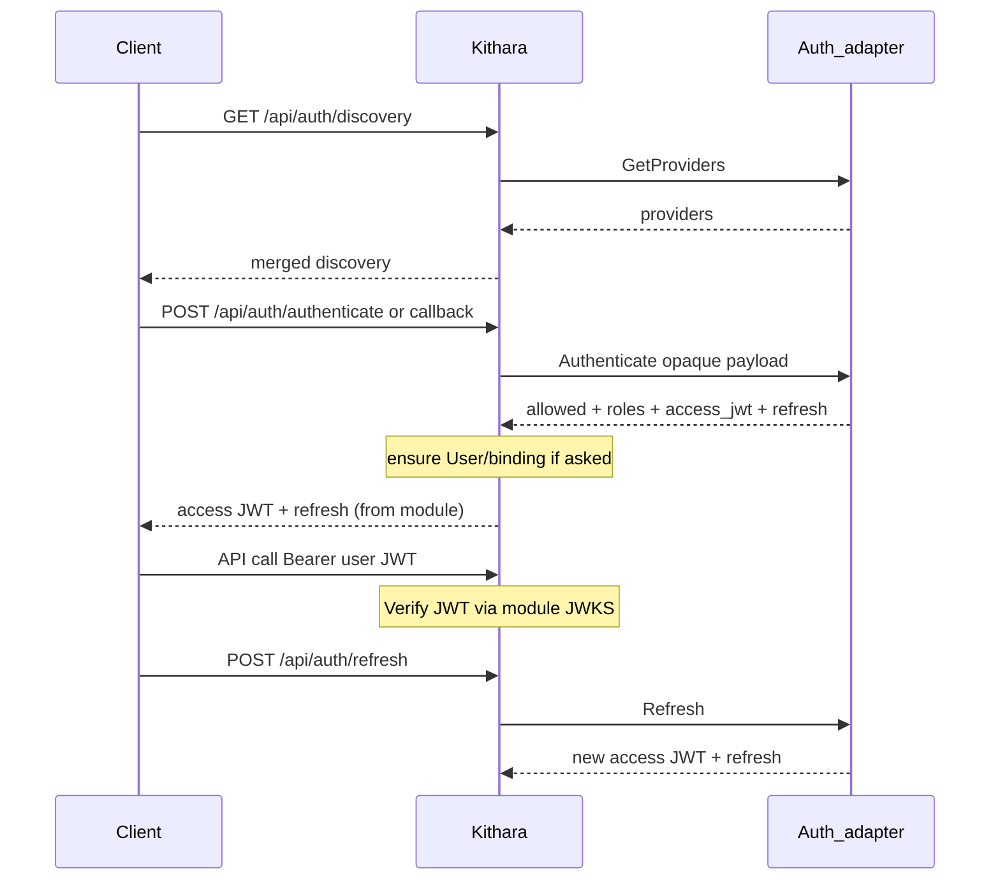

# Auth API and Permissions

Clients authenticate through **Kithara**, not by calling auth adapters on the public edge. Plume is optional — any client can use the same REST flow. Adapters stay on the internal gRPC plane.

**Token model (two JWT classes):**

| Class | Who mints | Who verifies | Use |
|-------|-----------|--------------|-----|
| **User / login JWT** (+ refresh) | Auth module (issue or forward) | Kithara via module JWKS | Logged-in API clients |
| **Guest control JWT** | **Kithara** | Kithara via its own signing key | Protected Struna control after guest-code exchange |

Kithara does **not** mint user/login JWTs. It **may** mint Struna-scoped guest capability JWTs. **Join secrets** authenticate modules (register + static admin) — not end-user credentials.

## Discovery

`GET /api/auth/discovery` — Auth Orchestrator merges `GetProviders()` from registered adapters. There is no built-in provider.

MVP: one `form_schema` provider from **Bes**. Client (e.g. Plume) renders fields from discovery — adapters do **not** host login HTML.

Redirect-style providers (Argus) advertise an authorize URL. The browser returns to **Kithara**, not to Plume or the adapter. Kithara forwards the opaque callback payload to that adapter’s `Authenticate`.

## Authenticate, refresh, and API access

| Method | Path | Description |
|--------|------|-------------|
| POST | `/api/auth/authenticate` | Opaque payload → module `Authenticate` → if allowed, **module-issued (or forwarded) JWT** + refresh |
| POST | `/api/auth/refresh` | Opaque refresh → module `Refresh` (e.g. Argus → IdP); returns new JWT + refresh |
| GET/POST | `/api/auth/callback` | Browser return for redirect flows; same path as authenticate — **not** OIDC-named |

Kithara does not mint user JWTs and does not interpret provider-specific crypto beyond verifying signatures with the module’s registered JWKS. It routes the bag, persists binding data when asked, and enforces Struna ACLs using claims/roles from the verified JWT (plus DB).

- **Refresh** is entirely on the auth-module side (Argus refreshes through the external OIDC provider; Bes/Hecate refresh with their own issuer logic).
- Revoke / logout: module- and IdP-dependent; Kithara may optionally denylist `jti` for emergencies.

## Guest control (protected Struna)

Short **guest codes** are Kithara-owned bootstrap secrets — **exchange only**, never sent on every control call.

| Method | Path | Description |
|--------|------|-------------|
| POST | `/api/streams/{id}/guest/exchange` | Body: guest code → **Kithara-signed guest control JWT** |

Guest JWT claims (sketch): `iss=kithara`, `struna_id`, `scope` ≈ `stream:control`, `exp`, optional `jti`. Bearer on subsequent control endpoints for **that Struna only**. Not a `User` — no auth-module binding. See [struna-access](../domains/struna-access.md).

## Secrets ownership

| Secret | Owner | Purpose |
|--------|-------|---------|
| User access JWT / refresh | **Auth module** (issue or forward) | Logged-in API clients; Kithara verifies via module JWKS |
| Guest control JWT | **Kithara** (mint) | Protected control after code exchange; Kithara verifies with its signing key |
| Guest code | **Kithara** (on Struna) | Bootstrap only — exchange for guest JWT (rate-limited) |
| Listen token | **Kithara** (on Struna) | Protected playback `/stream/{slug}?token=` (no exchange) |
| **Join secret** | **Kithara** config | Source / auth / client module identity — `Register`, heartbeats, and (for static clients) managed-user admin |

Listen tokens appear in player URLs and access logs — prefer rotation and short TTL where practical (MVP: query param; Basic Auth / path token eval in v0.2).

## User model (one DB)

Thin `User` rows plus per-provider **bindings** live in Kithara’s database — see [auth-adapters](../domains/auth-adapters.md). Auth modules have no separate user DB; they may request store/update via the authenticate result. Guests with only a guest control JWT are **not** Users.

## Client modules: user-aware vs static

When a **client module** registers with Kithara, it declares how it authenticates to the API:

| Mode | Meaning | Credential | Current modules |
|------|---------|------------|-----------------|
| **user-aware** | Acts on behalf of logged-in users | Bearer **user JWT** from an auth module | **Plume**, **Cauda** |
| **static** | Owns many **persistent module-managed users** (tenancy-separated) | **Join secret** (create/manage those users only) + **per-user credentials** for `/api` | **Beak** (one managed user per Discord guild) |

Do **not** authenticate many managed users with the shared **join secret**. See [clients](../domains/clients.md).

## Permission matrix (sketch)

| Action | Typical role / check |
|--------|----------------------|
| Create Struna | `stream:create` |
| Control playback | `stream:control` per Struna (user JWT, static per-user creds, or guest JWT) |
| Listen (private) | `stream:listen` per Struna |
| Link auth providers | authenticated user (explicit link flow) |
| Guest code exchange | valid guest code + rate limit (no prior login) |

**Org roles** may arrive in user JWT claims and/or from the module’s authenticate result stored on the binding. **Provider priority tier-list** arbitrates when multiple bindings disagree. **Struna ACLs** always live in Kithara.

## Join secrets

Long-lived secrets in Kithara config for **every** module (source, auth, client). Same credential authenticates `Register` / heartbeats at **container startup** (Compose / operator infra — not an end-user permission) and, for **static** clients, managed-user admin. Ordinary Struna/API work for static modules still uses each managed user’s own credentials — the join secret is not an impersonation key for those users.

**Related:** [domains/auth-adapters.md](../domains/auth-adapters.md) · [grpc-auth-adapter.md](grpc-auth-adapter.md) · [struna-access](../domains/struna-access.md) · [ADR 007](../adrs/007-auth-adapter-modules.md)

**Read next:** [rest-api.md](rest-api.md)
