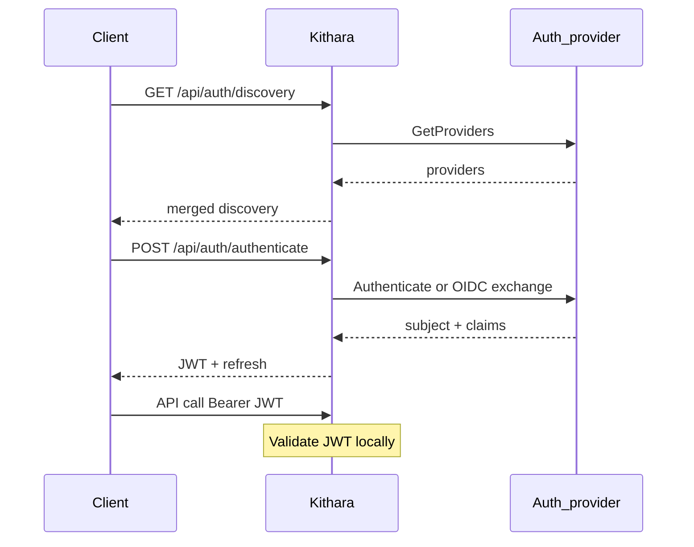

# Auth API and Permissions

Clients authenticate through **Kithara**, not through auth adapters. Plume is optional — any client can use the same REST flow. Adapters stay on the internal gRPC plane.

## Discovery

`GET /api/auth/discovery` — Auth Orchestrator merges `GetProviders()` from built-in local and registered adapters.

MVP: one `form_schema` provider from the **local** (login+password) provider. Client (e.g. Plume) renders fields from discovery — adapters do **not** host login HTML.

OIDC providers use `uiMode=redirect` with an IdP URL. Browser returns to **Kithara** (callback), not to Plume or the adapter.

## Authenticate and sessions

| Method | Path | Description |
|--------|------|-------------|
| POST | `/api/auth/authenticate` | Local credentials → identity proof → **Kithara-issued JWT** + refresh |
| POST | `/api/auth/refresh` | Rotate refresh → new JWT |
| GET | `/api/auth/oidc/callback` | OIDC code exchange on Kithara (v0.2+) |

After any successful identity proof (local or OIDC), **Kithara issues the API Bearer** (JWT). Adapters do not mint the client-facing token.

- Refresh is supported (operator-configurable TTL).
- Absolute / idle logout is configurable; OIDC-primary deploys may also lean on IdP session policy.
- Revoke: short JWT TTL + refresh rotation; optional denylist for emergencies.

## Secrets ownership

| Secret | Owner | Purpose |
|--------|-------|---------|
| User JWT / refresh | **Kithara** | Logged-in API clients |
| Listen token | **Kithara** (on Struna) | Protected playback `/stream/{slug}?token=` |
| Guest code | **Kithara** (on Struna) | Protected control without a full account |
| Service / join tokens | **Kithara** config | Bots and module registration |

Listen tokens appear in player URLs and access logs — prefer rotation and short TTL where practical (MVP: query param; Basic Auth / path token eval in v0.2).

## User model (one DB)

Thin `User` rows plus per-provider **bindings** live in Kithara’s database — see [auth-adapters](../domains/auth-adapters.md). Auth modules have no separate user DB.

## Permission matrix (sketch)

| Action | Typical role / check |
|--------|----------------------|
| Create Struna | `stream:create` |
| Control playback | `stream:control` on Struna ACL |
| Listen (private) | `stream:listen` or Struna ACL |
| Register source module | join secret + registry rules |
| Link auth providers | authenticated user (explicit link flow) |

**Org roles** may come from IdP groups mapped in Kithara (provider **priority tier-list** when multiple bindings disagree). **Struna ACLs** always live in Kithara.

## Service tokens

Long-lived tokens in Kithara env for bots — validated by the orchestrator without adapter RPC.

**Related:** [domains/auth-adapters.md](../domains/auth-adapters.md) · [grpc-auth-adapter.md](grpc-auth-adapter.md) · [ADR 007](../adrs/007-auth-adapter-modules.md)

**Read next:** [rest-api.md](rest-api.md)
