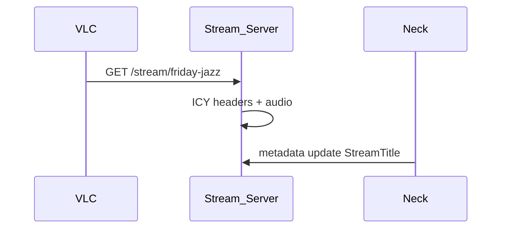

# HTTP Stream Output



`GET /stream/{slug}` — Kithara Stream Server ICY-over-HTTP output.

## Response headers

```
Content-Type: audio/mpeg
icy-name: Friday Night Jazz
icy-genre: Bardie
icy-metaint: 8192
```

Inline metadata blocks: `StreamTitle='Artist - Title';`

## Auth by playback mode

| Mode | Request |
|------|---------|
| public | `GET /stream/{slug}` |
| protected | `GET /stream/{slug}?token=...` (MVP) |
| private | Bearer session or 403 for anonymous players |

## Legacy player notes

- Paste full URL including query token into VLC / VRChat
- Private + OIDC not supported in external players
- Bots use service token or protected Struna with known token

**Related:** [domains/struna-access.md](../domains/struna-access.md) · [ADR 002](../adrs/002-kithara-native-ffmpeg-streaming.md)

**Read next:** [streaming-stack.md](streaming-stack.md)
