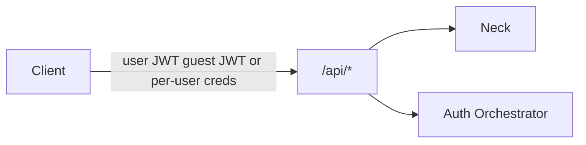

# REST API (MVP sketch)

Client-facing HTTP API on Kithara (any client module). Base path: `/api`.

**Phases 4–6 target:** create is **encode-alive** once Phase 4 lands (session FIFO + silence feeder + FFmpeg → continuous MP3). Phase 3 left create **control-alive** (slug + FIFO + guest secrets; DJ REST without encoder). Stream Server ICY (`GET /stream/{slug}`) is Phase 5. Grant CRUD + guest refresh + rate-limit are Phase 6 contracts below.

**Credentials (auth locks):**

| Caller | Credential on `/api` |
|--------|----------------------|
| User-aware clients | Bearer **user JWT** from an auth module |
| Static clients | **Per-user credentials** for day-to-day; **join secret** only for managed-user admin |
| Protected-control guests | Bearer **ephemeral guest JWT** after code exchange (Kithara-minted for a new ephemeral guest user) |

See [auth.md](auth.md).

## Auth

| Method | Path | Description |
|--------|------|-------------|
| GET | `/api/auth/discovery` | Aggregated auth providers |
| POST | `/api/auth/authenticate` | Opaque login → module JWT + refresh |
| POST | `/api/auth/refresh` | Refresh → new JWT (module **or** host guest path — see below) |
| GET/POST | `/api/auth/callback` | Browser return for redirect flows (forwarded to module) |

Kithara verifies **login** JWTs via module JWKS; it does not mint them. It **does** mint JWTs for **ephemeral guest users** (see below).

**Guest refresh (Phase 6 / SEC-01):** before dialing an auth module, `POST /api/auth/refresh` detects Kithara guest material (e.g. claim `bardie_provider=kithara.guest`), validates the refresh locally, and remints access (+ refresh) until the Struna still exists / capped lifetime. Login refresh still routes to the adapter.

## Guest control

| Method | Path | Description |
|--------|------|-------------|
| POST | `/api/streams/{id}/guest/exchange` | **Unauthenticated** bootstrap. Body: short guest code → create **ephemeral guest user** + Kithara-signed JWT (+ refresh) |

Rate-limit is Phase 6 (SEC-05: per-IP + per-Struna; failures → `429`). Each exchange creates a **new** ephemeral guest user for that joiner (Struna-scoped; destroyed with the Struna). Do not send the guest code on every request. Details: [struna-access](../domains/struna-access.md).

## Strunas

Wire paths stay English (`/api/streams`); product language is **Struna**.

| Method | Path | Description |
|--------|------|-------------|
| GET | `/api/streams/listen` | List Strunas the principal may **listen** to (owner + grant; public for everyone) |
| GET | `/api/streams/control` | List Strunas the principal may **control** (owner + grant + protected-control guest) |
| POST | `/api/streams` | Create — **encode-alive** target (Phase 4): slug unique among alive Strunas, session FIFO, silence + FFmpeg, guest code; listen token when playback is protected. Today (pre-4): control-alive only |
| GET | `/api/streams/{id}` | Get by internal GUID (listen **or** control ACL) |
| POST | `/api/streams/{id}/pause` | Pause: silence feeder on + optional module `PauseTrack` (Phase 4 semantics) |
| DELETE | `/api/streams/{id}` | Tear down: stop track, stop silence, kill FFmpeg, close FIFO, free slug, destroy guests + clear their **search cache** |
| POST | `/api/streams/{id}/skip` | Stop current track job → next queue entry (encoder stays up) |
| GET | `/api/streams/{id}/now-playing` | Current track / Neck snapshot (same source as ICY `StreamTitle` once Phase 5 exists) |

There is **no** separate `POST …/stop` — same lifecycle as `DELETE`. There is **no** bare `GET /api/streams` list — use `/listen` or `/control`.

Create accepts slug, title, and access modes. Owner create response includes `guest_code` and `listen_token` (when applicable). **Operator encode profile (locked):** PCM s16le / 48 kHz / stereo → MP3 (~128 kbps, `libmp3lame`) — not a user-facing create field.

**Slug uniqueness:** among alive Strunas only. Path prefixes isolate listen URLs (`/stream/{slug}`) from API (`/api/…`) — we do **not** block names like `api` or `player` as reserved route collisions.

ACL: owner + grant (+ protected-control ephemeral guest for control). **Grant CRUD** and **managed permission ceiling** are Phase 6 — see below and [struna-access](../domains/struna-access.md).

### Grants (Phase 6 — owner only)

Persist via `StrunaControlGrant`. Owner of the Struna only.

| Method | Path | Description |
|--------|------|-------------|
| GET | `/api/streams/{id}/grants` | List control grants |
| POST | `/api/streams/{id}/grants` | Body `{ "user_id": "…" }` — grant control to that durable/managed user |
| DELETE | `/api/streams/{id}/grants/{userId}` | Revoke grant |

Managed users: on static-client Register, store `permission_ceiling`; enforce on create-struna / grant mutations (deny above ceiling). User-aware clients (Plume) are unconstrained by ceiling.
## Play

| Method | Path | Description |
|--------|------|-------------|
| POST | `/api/streams/{id}/play` | Empty body → **unpause** (`ResumeTrack` on the active job). With body → start a **specific** track now |
| POST | `/api/streams/{id}/quickplay` | Search then play the **first** result |

Download / blob cache hit-or-miss is the **source module’s** job on `StartTrack`. Kithara only dials the module with module slug + track ref + session FIFO endpoint.

### `play` body (when present)

Resolved intent — one of:

| Shape | Fields (sketch) | Notes |
|-------|-----------------|-------|
| Library / tune | `tune_id` | Replay from library/history (any module, incl. sparse Starling Tunes) |
| Search-result ref | `search_result_id` or alias `result_id` → resolves to / creates Tune | Opaque; principal-scoped **search cache** (not search history) |
| Direct ref | `module` + module-native id / URI | Creates/updates a Tune then plays (Magpie URL; Starling stream URI) |

Empty body does **not** start a new track — it only resumes the active job (Phase 4: silence feeder off + optional `ResumeTrack`).

### `quickplay` body

| When | Payload |
|------|---------|
| Source selected | `module` + plain-text query (`q` or alias `query`) |
| Source omitted | Plain-text query only (`q` / `query`) |

Kithara picks the source with the **highest configured priority**, or the user’s **default source**, then tries **lower-priority** sources on empty results.

**Contributor guidance:** when a plain-text search fails, source modules should fall back to treating the query as a **local / native id** lookup (e.g. Magpie: URL or video id) before returning empty.

## Queue

| Method | Path | Description |
|--------|------|-------------|
| GET | `/api/streams/{id}/queue` | List queue |
| POST | `/api/streams/{id}/queue` | Append a **Tune** (same body shapes as `play` — resolve/create Tune then enqueue) |
| POST | `/api/streams/{id}/quickqueue` | Quick-search and append the **first** result (same selection rules as `quickplay`) |
| DELETE | `/api/streams/{id}/queue/{entryId}` | Remove queue entry |

## Search

Search is **global** (not under a Struna id).

**Search cache ≠ search / listen history.**

| Concept | Purpose |
|---------|---------|
| **Search cache** | Short-lived, principal-scoped refs so `play` / `queue` can cite an opaque `search_result_id` without re-searching. Cleared on guest teardown; durable principals replace on next search or TTL |
| **History** | Durable library/play history via **Tunes** (and future history APIs) — not this cache |

| Method | Path | Description |
|--------|------|-------------|
| GET | `/api/search/quick` | Plain-text query (`q` or `query`, optional `module=…`) |
| POST | `/api/search` | Regular (structured) search — body depends on the source module |

### Quicksearch (`GET`)

Fan-out or single-module plain-text search. Semantically equivalent to searching with only the mandatory **title** field.

### Regular search (`POST`)

Structured payload per source. Modules **advertise search field capabilities** at registration (see [source-modules](../domains/source-modules.md)).

| Field | Rule |
|-------|------|
| `title` | **Mandatory** on every searchable module; alone ≈ quicksearch |
| `artist`, `owner`, … | Encouraged where they apply (`owner` = uploader / first querier for Magpie) |

Omit `module` to fan out across sources that advertise `search` (and compatible fields). Results always include `module` slug + track ref (and a cacheable result id) for `play` / `queue`.

Quickplay / quickqueue still pick a source via configured **priority** (and later user default) — multi-source capable from day one; not Magpie-special-cased.

## Errors

- `409` — slug conflict among alive Strunas
- `401` / `403` — auth / permission per [struna-access](../domains/struna-access.md)
- `404` — unknown Struna / queue entry; or no quicksearch/quickplay hit after fallbacks
- `429` — guest exchange rate-limited (Phase 6 / SEC-05)
- `502` — source/auth **module dial failed** (gRPC/capability/search/`StartTrack`/`PauseTrack`/… upstream error). Body includes an `error` string; do not treat as a client validation failure

**Related:** [auth.md](auth.md) · [struna-access](../domains/struna-access.md) · [playback-control](../domains/playback-control.md) · [source-modules](../domains/source-modules.md) · [streams](../domains/streams.md)

**Read next:** [grpc-source-module.md](grpc-source-module.md)
