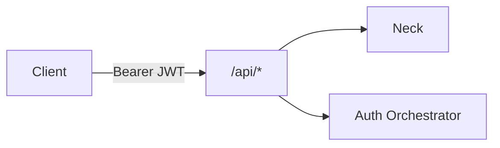

# REST API (MVP sketch)

Client-facing HTTP API on Kithara (Plume or any other client). Base path: `/api`.

## Auth

| Method | Path | Description |
|--------|------|-------------|
| GET | `/api/auth/discovery` | Aggregated auth providers |
| POST | `/api/auth/authenticate` | Local login → Kithara JWT + refresh |
| POST | `/api/auth/refresh` | Refresh → new JWT |
| GET | `/api/auth/oidc/callback` | OIDC callback on Kithara (v0.2+) |

## Strunas

| Method | Path | Description |
|--------|------|-------------|
| GET | `/api/streams` | List **alive** Strunas |
| POST | `/api/streams` | Create — becomes **alive** immediately (slug reserved, FFmpeg + FIFO start) |
| GET | `/api/streams/{id}` | Get by internal GUID |
| POST | `/api/streams/{id}/pause` | Silence; keep FFmpeg + slug |
| POST | `/api/streams/{id}/stop` | Kill FFmpeg, close session, **free slug** |
| DELETE | `/api/streams/{id}` | Remove resource (stop first if still alive) |
| POST | `/api/streams/{id}/play` | Play queue entry / search result (`module` slug + track ref) |
| POST | `/api/streams/{id}/skip` | Stop current track job → next queue entry |
| GET | `/api/streams/{id}/now-playing` | Current track metadata |
| GET | `/api/streams/{id}/queue` | List queue |
| POST | `/api/streams/{id}/queue` | Append QueueEntry |
| DELETE | `/api/streams/{id}/queue/{entryId}` | Remove queue entry |

Create accepts slug, title, access modes, and **encode mode** (`compatibility` \| `quality`).

## Search

| Method | Path | Description |
|--------|------|-------------|
| POST | `/api/streams/{id}/search` | Body: optional `module` slug; omit to **fan-out** across registered sources |

Results include `module` slug + track ref for queue/play.

## Errors

- `409` — slug conflict among alive Strunas
- `401` / `403` — auth / permission per [struna-access](../domains/struna-access.md)

**Related:** [interfaces/auth.md](auth.md) · [domains/playback-control.md](../domains/playback-control.md) · [domains/streams.md](../domains/streams.md)

**Read next:** [grpc-source-module.md](grpc-source-module.md)
