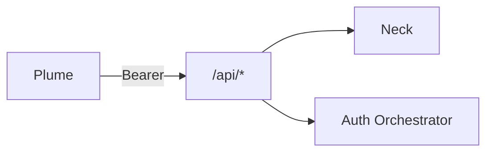

# REST API (MVP sketch)

Plume-facing HTTP API on Kithara. Base path: `/api`.

## Auth

| Method | Path | Description |
|--------|------|-------------|
| GET | `/api/auth/discovery` | Aggregated auth providers |

## Strunas

| Method | Path | Description |
|--------|------|-------------|
| GET | `/api/streams` | List active Strunas |
| POST | `/api/streams` | Create (slug, title, access modes) |
| GET | `/api/streams/{id}` | Get by internal GUID |
| DELETE | `/api/streams/{id}` | Stop and free slug |
| POST | `/api/streams/{id}/play` | Play queue entry / search result |
| POST | `/api/streams/{id}/skip` | Skip current track |
| GET | `/api/streams/{id}/now-playing` | Current track metadata |

## Search (delegates to source module)

| Method | Path | Description |
|--------|------|-------------|
| POST | `/api/streams/{id}/search` | Search YouTube (MVP) |

## Errors

- `409` — slug conflict among active Strunas
- `401` / `403` — auth / permission per [struna-access](../domains/struna-access.md)

**Related:** [interfaces/auth.md](auth.md) · [domains/playback-control.md](../domains/playback-control.md)

**Read next:** [grpc-source-module.md](grpc-source-module.md)
