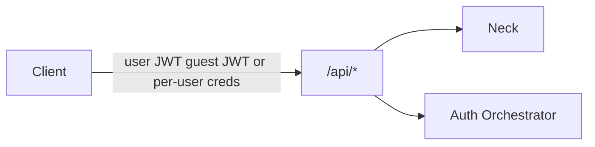

# REST API (MVP sketch)

Client-facing HTTP API on Kithara (any client module). Base path: `/api`.

**Credentials (auth locks):**

| Caller | Credential on `/api` |
|--------|----------------------|
| User-aware clients | Bearer **user JWT** from an auth module |
| Static clients | **Per-user credentials** for day-to-day; **join secret** only for managed-user admin |
| Protected-control guests | Bearer **ephemeral guest JWT** after code exchange (Kithara-minted for a new ephemeral guest user) |

See [auth.md](auth.md).

## Auth

| Method | Path | Description |
|--------|------|-------------|
| GET | `/api/auth/discovery` | Aggregated auth providers |
| POST | `/api/auth/authenticate` | Opaque login → module JWT + refresh |
| POST | `/api/auth/refresh` | Module-side refresh → new JWT |
| GET/POST | `/api/auth/callback` | Browser return for redirect flows (forwarded to module) |

Kithara verifies **login** JWTs via module JWKS; it does not mint them. It **does** mint JWTs for **ephemeral guest users** (see below).

## Guest control

| Method | Path | Description |
|--------|------|-------------|
| POST | `/api/streams/{id}/guest/exchange` | Body: short guest code → create **ephemeral guest user** + Kithara-signed JWT (+ refresh) |

Rate-limited. Each exchange creates a **new** ephemeral guest user for that joiner (Struna-scoped; destroyed with the Struna). Do not send the guest code on every request. Details: [struna-access](../domains/struna-access.md).

## Strunas

| Method | Path | Description |
|--------|------|-------------|
| GET | `/api/streams` | List **alive** Strunas |
| POST | `/api/streams` | Create — **alive** immediately (slug reserved, FFmpeg + FIFO start) |
| GET | `/api/streams/{id}` | Get by internal GUID |
| POST | `/api/streams/{id}/pause` | Silence; keep FFmpeg + slug (resume via empty `play`) |
| DELETE | `/api/streams/{id}` | Tear down: kill FFmpeg, close session, **free slug**, remove resource |
| POST | `/api/streams/{id}/skip` | Stop current track job → next queue entry |
| GET | `/api/streams/{id}/now-playing` | Current track metadata |

There is **no** separate `POST …/stop` — same lifecycle as `DELETE`.

Create accepts slug, title, and access modes. Listener encode profile is **operator/FFmpeg config** for MVP — not a user-facing create field until we prove we need it (see implementation plan).

## Play

| Method | Path | Description |
|--------|------|-------------|
| POST | `/api/streams/{id}/play` | Empty body → **unpause**. With body → start a **specific** track now |
| POST | `/api/streams/{id}/quickplay` | Search then play the **first** result |

### `play` body (when present)

Resolved intent — one of:

| Shape | Fields (sketch) | Notes |
|-------|-----------------|-------|
| Library / tune | Tune id | Replay from library/history (any module, incl. sparse Starling Tunes) |
| Search-result ref | Cached search result id → resolves to / creates Tune | Opaque; principal-scoped cache |
| Direct ref | `module` + module-native id / URI | Creates/updates a Tune then plays (Magpie URL; Starling stream URI) |

Empty body does **not** start a new track — it only clears pause (silence feeder off; current/next job resumes as designed).

### `quickplay` body

| When | Payload |
|------|---------|
| Source selected | `module` + plain-text query |
| Source omitted | Plain-text query only |

Kithara picks the source with the **highest configured priority**, or the user’s **default source**, then tries **lower-priority** sources on empty results.

**Contributor guidance:** when a plain-text search fails, source modules should fall back to treating the query as a **local / native id** lookup (e.g. Magpie: URL or video id) before returning empty.

## Queue

| Method | Path | Description |
|--------|------|-------------|
| GET | `/api/streams/{id}/queue` | List queue |
| POST | `/api/streams/{id}/queue` | Append a **Tune** (same body shapes as `play` — resolve/create Tune then enqueue) |
| POST | `/api/streams/{id}/quickqueue` | Quick-search and append the **first** result (same selection rules as `quickplay`) |
| DELETE | `/api/streams/{id}/queue/{entryId}` | Remove queue entry |

## Search

Search is **global** (not under a Struna id). Results are **cached** so the caller can play/queue by opaque result ref without re-searching. Cache entries are **principal-scoped**: only the durable user, managed user, or ephemeral guest that invoked the search may use those refs (prevents cross-user leakage).

**Cache lifetime:**

| Principal | Lifetime |
|-----------|----------|
| Ephemeral guest | Until Struna teardown (cache cleared with the guest) |
| Durable / managed | Until that principal’s **next search** replaces it, or a **configurable timeout** elapses |

| Method | Path | Description |
|--------|------|-------------|
| GET | `/api/search/quick` | Plain-text query (`q=…`, optional `module=…`) |
| POST | `/api/search` | Regular (structured) search — body depends on the source module |

### Quicksearch (`GET`)

Fan-out or single-module plain-text search. Semantically equivalent to searching with only the mandatory **title** field.

### Regular search (`POST`)

Structured payload per source. Modules **advertise search field capabilities** at registration (see [source-modules](../domains/source-modules.md)).

| Field | Rule |
|-------|------|
| `title` | **Mandatory** on every searchable module; alone ≈ quicksearch |
| `artist`, `owner`, … | Encouraged where they apply (`owner` = uploader / first querier for Magpie) |

Omit `module` to fan out across sources that advertise `search` (and compatible fields). Results always include `module` slug + track ref (and a cacheable result id) for `play` / `queue`.

Quickplay / quickqueue still pick a source via configured **priority** (and later user default) — multi-source capable from day one; not Magpie-special-cased.

## Errors

- `409` — slug conflict among alive Strunas
- `401` / `403` — auth / permission per [struna-access](../domains/struna-access.md)
- `404` — unknown Struna / queue entry; or no quicksearch/quickplay hit after fallbacks
- `429` — guest exchange rate-limited

**Related:** [auth.md](auth.md) · [struna-access](../domains/struna-access.md) · [playback-control](../domains/playback-control.md) · [source-modules](../domains/source-modules.md) · [streams](../domains/streams.md)

**Read next:** [grpc-source-module.md](grpc-source-module.md)
