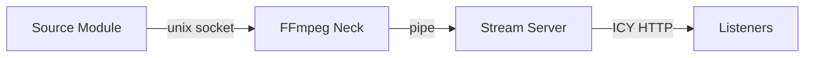

# Streaming Stack



## Pipeline

```
Source Module → [unix socket] → FFmpeg (Struna Encoder) → [pipe] → Stream Server → Listeners
```

| Component | Location | Role |
|-----------|----------|------|
| FFmpeg | Kithara / Neck | Encode MP3 from socket |
| Stream Server | Kithara | Serve `/stream/{slug}` + ICY metadata |
| Icecast | — | Not in MVP; community-demand-only footnote in [ADR 002](../adrs/002-kithara-native-ffmpeg-streaming.md) |

## Why not Icecast mounts

Icecast uses separate listener endpoints (mounts). Bardie serves ICY metadata directly from Kithara — same player compatibility, fewer containers.

**Related:** [interfaces/http-stream-output.md](http-stream-output.md) · [domains/streams.md](../domains/streams.md)

**Read next:** [auth.md](auth.md)
