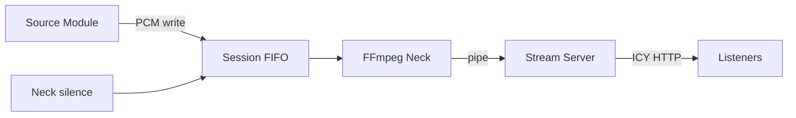

# Streaming Stack



## Pipeline

```
Source module track job → [Kithara FIFO] → FFmpeg (Struna Encoder) → [pipe] → Stream Server → Listeners
```

| Component | Location | Role |
|-----------|----------|------|
| Session FIFO | Kithara scratch | Long-lived PCM endpoint per alive Struna |
| Silence feeder | Neck | Keeps FFmpeg fed when no module writer |
| FFmpeg | Kithara / Neck | Encode MP3 (or configured profile) from FIFO |
| Stream Server | Kithara | Serve `/stream/{slug}` + ICY metadata |
| Icecast | — | Not in MVP |

## Listener encode vs internal PCM

Internal PCM is never seen by VLC. Listener quality uses Struna **compatibility** / **quality** encode modes (operator/user property caps planned for public hosting).

## Why not Icecast mounts

Icecast uses separate listener endpoints (mounts). Bardie serves ICY metadata directly from Kithara — same player compatibility, fewer containers.

**Related:** [interfaces/http-stream-output.md](http-stream-output.md) · [domains/streams.md](../domains/streams.md) · [ADR 004](../adrs/004-source-instance-socket-audio-plane.md)

**Read next:** [auth.md](auth.md)
