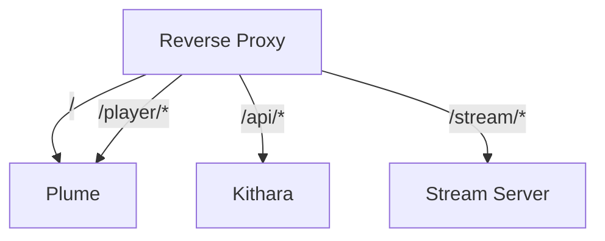

# URI Routing

One public domain; path-based routing at the reverse-proxy edge (bundled in Compose or your existing edge — product-agnostic). Listeners paste a stream URL; DJs hit `/player/{slug}`; APIs stay under `/api`.

## Route table

| Path             | Target                | Auth                     |
| ---------------- | --------------------- | ------------------------ |
| `/`              | Plume                 | Yes (auth adapter)       |
| `/player/{slug}` | Plume                 | Per Struna control mode  |
| `/api/*`         | Kithara REST          | Per endpoint + token     |
| `/stream/{slug}` | Kithara Stream Server | Per Struna playback mode |

## Slug in URLs

- Listener: `https://bardie.example/stream/friday-jazz`
- Control: `https://bardie.example/player/friday-jazz`
- API uses internal GUID: `/api/streams/{id}/skip`

## Internal Docker networking

Image/service names use the `bardie_*` prefix once chosen. MVP auth and YouTube module names are **undecided**. Compose may advertise short DNS aliases for dial targets — keep both conventions documented when they differ. Only proxy + Kithara public ports are exposed.

## Repos needing follow-up

| Change | Follow up in |
|--------|----------------|
| Path map `/`, `/player/*`, `/api/*`, `/stream/*` | **bardie-plume** (client routes), **org edge/Compose** ([05-deployment](https://github.com/Bardie-radio/.github/blob/main/profile/docs/architecture/05-deployment.md)) |
| Service DNS / published ports | Org reference Compose, module Compose snippets |

**Related:** [operations/deployment.md](../operations/deployment.md) · [ADR 009](../adrs/009-struna-access-and-routing.md) · [org deployment](https://github.com/Bardie-radio/.github/blob/main/profile/docs/architecture/05-deployment.md)

**Read next:** [http-stream-output.md](http-stream-output.md)
