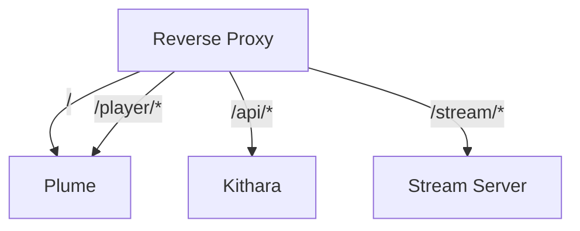

# URI Routing

One public domain; path-based routing (Caddy or Traefik in Compose).

## Route table

| Path | Target | Auth |
|------|--------|------|
| `/` | Plume | Yes (auth adapter) |
| `/player/{slug}` | Plume | Per Struna control mode |
| `/api/*` | Kithara REST | Per endpoint + token |
| `/stream/{slug}` | Kithara Stream Server | Per Struna playback mode |

## Slug in URLs

- Listener: `https://bardie.example/stream/friday-jazz`
- Control: `https://bardie.example/player/friday-jazz`
- API uses internal GUID: `/api/streams/{id}/skip`

## Internal Docker networking

Modules use service names (`youtube-module:5001`, `auth-local:5002`). Only proxy + Kithara public ports exposed.

**Related:** [operations/deployment.md](../operations/deployment.md) · [ADR 009](../adrs/009-struna-access-and-routing.md)

**Read next:** [http-stream-output.md](http-stream-output.md)
