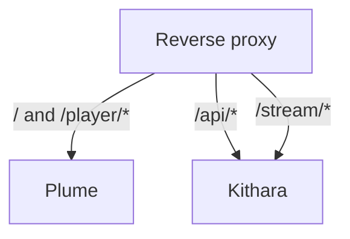

# URI Routing

Public path map for one Bardie hostname. Edge product and Compose layout live in [org deployment](https://github.com/Bardie-radio/.github/blob/main/profile/docs/architecture/05-deployment.md); this page is the **contract** those stacks must honour.

**Stream Server is inside Kithara** — `/stream/*` is not a separate container. Plume is optional; without it, `/` and `/player/*` simply have no UI target at the edge.

## Route table

| Path | Target | Auth |
|------|--------|------|
| `/` | Plume (optional) | Auth required when Plume is used |
| `/player/{slug}` | Plume (optional) | Per Struna control mode |
| `/api/*` | Kithara REST (incl. auth + `…/guest/exchange`) | User JWT; guest control JWT; join secret only for static-module admin |
| `/stream/{slug}` | Kithara Stream Server | Per Struna playback mode |

gRPC (`:5000`) is **not** on this map — modules reach Kithara on the internal network only. Auth adapters are never public edge targets.

Beak, Cauda, Magpie, Bes, … do **not** get public path prefixes; they talk to Kithara over REST or gRPC as modules.

## Slug in URLs

- Listener: `https://bardie.example/stream/friday-jazz`
- Control UI: `https://bardie.example/player/friday-jazz`
- API uses internal GUID: `/api/streams/{id}/skip`

## What Kithara owns on the wire

| Surface | Audience |
|---------|----------|
| HTTP `/api/*`, `/stream/{slug}` | Edge → Kithara |
| gRPC register / control | Modules only (never publish publicly) |

Long-lived `/stream/{slug}` needs generous proxy read timeouts — see [operations/deployment](../operations/deployment.md).

## Repos needing follow-up

| Change | Follow up in |
|--------|--------------|
| Path map `/`, `/player/*`, `/api/*`, `/stream/*` | **bardie-plume** (UI routes); **org** edge/Compose ([05-deployment](https://github.com/Bardie-radio/.github/blob/main/profile/docs/architecture/05-deployment.md)) |
| Published ports / service DNS | Org reference Compose — not duplicated here |

**Related:** [operations/deployment.md](../operations/deployment.md) · [auth.md](auth.md) · [ADR 009](../adrs/009-struna-access-and-routing.md) · [org deployment](https://github.com/Bardie-radio/.github/blob/main/profile/docs/architecture/05-deployment.md)

**Read next:** [http-stream-output.md](http-stream-output.md)
