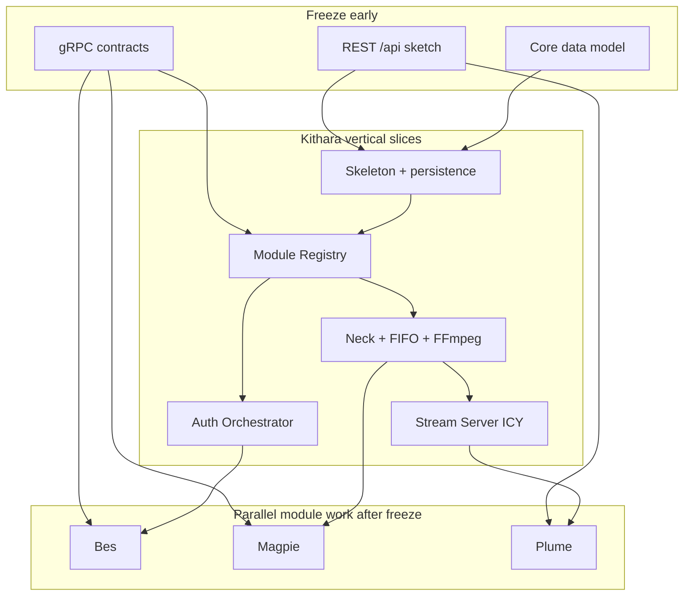

# Implementation plan (v0.1)

Ordered build plan to bring Kithara (and the MVP module stack) alive without coupling modules to each other’s guts.

**Scope:** [v0.1-scope.md](v0.1-scope.md) · **Milestone sketch:** [v0.1-milestones.md](v0.1-milestones.md)

This page is the **how and in what order**. Milestones stay the short delivery ladder; here we expand work packages, freeze points, and modularity rules.

## Philosophy: modularity first

Kithara must not care **which** auth, source, or UI module is connected — only that each speaks the **unified contract for its type**. Modules must not depend on each other’s implementation details.


| Rule                                  | Means in practice                                                                                                                                      |
| ------------------------------------- | ------------------------------------------------------------------------------------------------------------------------------------------------------ |
| **One contract per module type**      | Source → `SourceModule` gRPC; Auth → `AuthModule` gRPC; Client → `ClientModule` gRPC + REST `/api` for UX; **all** kinds join via Module Registry gRPC |
| **Opaque payloads at the edge**       | Clients never call Bes/Magpie; Kithara routes bags and verifies tokens                                                                                 |
| **Identity by slug + join secret**    | Module swap = Compose + secret map, not Kithara code changes                                                                                           |
| **Orchestrators as libraries**        | Auth module orch + source module orch are **library-shaped** (host ports for persistence / storage / Bardie extras). Kithara is one host; outside reuse is planned — [org 07](https://github.com/Bardie-radio/.github/blob/main/profile/docs/architecture/07-modules-beyond-bardie.md) |
| **Spike code is not the model**       | Follow docs/ADRs over `Neck.cs` / prototype `Tune`/`Playlist` shapes                                                                                   |
| **Freeze the socket before the guts** | Lock proto/REST sketches enough to implement both sides, then fill behaviour                                                                           |
| **OTel from day one**                 | Wire OpenTelemetry in `Program.cs` / module entrypoints in **Phase 1** — not a Phase 8 afterthought. Auto-instrument HTTP/gRPC/EF; custom spans only where middleware is blind (Neck, FIFO, FFmpeg). |


If a feature requires Magpie to know Bes exists (or Plume to know Magpie’s ytdl quirks), the design is wrong — put the knowledge in Kithara’s orchestrators or in the shared contract.




## Current baseline (honest)

**Phases 1–3 complete.** Phase 3 closed on Search/StartTrack/FIFO/storage/EnsureTune + Magpie + Local smoke (control-alive DJ REST; no FFmpeg). Residual from that vertical (`TrackStatus` consume → Phase 4; CI E2E → Phase 8) is owned below — not open Phase 3 work. **Phases 4–6 run in parallel** from here — encode, ICY, and control/auth hardening do not wait on each other, but do not ship behaviour that bypasses an unfrozen contract. Spike Controllers / Playlist / Neck are gone from runtime — see [spike/prototype-neck-ffmpeg](../spike/prototype-neck-ffmpeg.md) for historical FFmpeg notes only.

Security findings from the Phases 1–3 review live in [security-audit.md](security-audit.md); **active remediations are Phases 4–6**. Non-security follow-ups are mapped into Phases **4 / 5 / 6 / 8** below (no extra phase).


| Area    | Today                                                          | Phases 4–6 (parallel) + later                    |
| ------- | -------------------------------------------------------------- | ------------------------------------------------ |
| Layout  | Feature folders + packable Module.* / Orchestrator.* / Contracts | Encode + ICY + control/auth hardening            |
| Models  | ADR 006 EF entities + migrations                               | Grant CRUD depth; roles on bindings (6)          |
| Auth    | Orch + Bes + JWT Bearer `/api/auth/*` + `seedAdmin`            | Security P0/P1 (6); provider_id→module map (6)   |
| Audio   | Session FIFO + Magpie PCM (sine proof + YouTube path)          | FFmpeg + silence (4) → Stream Server (5)         |
| Control | Most Phase 6 REST landed under Phase 3 (no FFmpeg)             | Guest refresh/rate-limit; grants; ceiling; roles |
| Modules | Registry + mTLS; Bes live; Magpie source RPCs live             | Channel host↔slug pin (4); Plume (7)             |

## Phase map

Phases are **dependency-ordered** for *shipping* outcomes. **Phases 4–6 are implemented in parallel** after Phase 3: Neck/encode, Stream Server stubs, and control/auth hardening may proceed together; integrate at Phase 8.


| Phase | Name             | Outcome                                                               | Status |
| ----- | ---------------- | --------------------------------------------------------------------- | ------ |
| **1** | Kithara skeleton | Feature layout, DB, Module Registry, join secrets, **OTel bootstrap** | Complete |
| **2** | Auth vertical | Orchestrator + Bes + JWT verify + bootstrap user path | Complete |
| **3** | Source vertical | Source protocol + Magpie proof (`Search` / `StartTrack` / FIFO write) | Complete |
| **4** | Neck + encode | Alive Struna, silence feeder, FFmpeg supervisor + **Channel peer pin (SEC-06)** | **Active (parallel)** |
| **5** | Stream Server | `GET /stream/{slug}` ICY + listen-token gate | **Active (parallel)** |
| **6** | Control REST + auth hardening | Remaining control depth + **security P0/P1** + orch routing (DES-01) | **Active (parallel)** |
| **7** | Plume MVP | Discovery login + control UI (optional client) | After enough of 5–6 |
| **8** | Compose + verify | Reference stack, join secrets, OTLP E2E, **QA/OPS/DOC debt** | After 4–6 |


Phase 7 needs Phase 2 + enough of 5–6. Phase 8 needs MVP apps green enough to compose — OTel export itself is already live from Phase 1 / each module’s first boot.

### Phases 1–3 review → phase ownership

| ID | Kind | Summary | Phase |
|----|------|---------|-------|
| SEC-01 | Security P0 | Guest refresh path missing | **6** |
| SEC-02 | Security P0 | `EnsureTune` storage_key ownership | **6** |
| SEC-03 | Security P0 | `must_rotate_credentials` never enforced | **6** |
| SEC-07 | Security P0 | Every Bes mint → `roles=[admin]` | **6** |
| SEC-04 | Security P1 | JWKS sync-over-async | **6** |
| SEC-05 | Security P1 | Guest exchange rate-limit | **6** |
| SEC-06 | Security P1 | Channel host↔slug mTLS pin | **4** |
| DES-01 | Design/debt | Auth orch: `provider_id`→module from discovery (still pass `provider_id` on wire) | **6** |
| DES-02 | Design/debt | Wire `TrackStatus` / recover jobs; Neck in-memory map | **4** |
| QA-01 | QA | Host integration tests; Magpie/Bes module-local tests | **8** (+ land tests with 4–6 PRs) |
| OPS-01 | Ops | Phase3 sine smoke vs Magpie Release image | **8** |
| DOC-01 | Docs | Doc vs code drift (Tune path, Bes ops, Magpie scope, phase status) | **8** |
| MESH-REG-* | Mesh residual | Join-secret takeover / auto key-on-wire / ephemeral CA | Ops + backlog ([security-audit](security-audit.md)) |

### OTel in practice (ASP.NET / modules)

You do not hand-wrap every method. Typical pattern:

1. **Bootstrap once** in `Program.cs` (or module main): OpenTelemetry SDK + OTLP exporter + `service.name=bardie.kithara` (etc.).
2. **Auto-instrumentation** for ASP.NET Core HTTP, gRPC, HttpClient, EF Core — middleware/handlers create spans for inbound/outbound calls and propagate W3C `traceparent`.
3. **Custom Activity / spans** only where auto-instrumentation is blind: Neck lifecycle, silence feeder, FFmpeg process, session FIFO attach, track-job state machines.
4. **Attributes** from [observability](../operations/observability.md): `struna.id`, `struna.slug`, `source.module`, … — never tokens/passwords.
5. If `OTEL_EXPORTER_OTLP_ENDPOINT` is unset, export can no-op or log locally; when the collector is present, traces already flow.

Same contract on Bes/Magpie/Plume from their first runnable container ([ADR 008](../adrs/008-otel-observability.md)).

---


## Phase 0 — Contract freeze

**Why first:** Magpie/Bes/Plume cannot safely implement against moving sketches. Modularity dies if each module invents its own register/auth/play shape.

### Work

1. **Own the** `.proto` **files in** `libs/Bardie.Contracts` **and publish a versioned package** (`Bardie.Contracts`) for module authors — single source of truth for:
  - `ModuleRegistry` on Kithara (modules dial in; mTLS cert issued on success)
  - `AuthAdapter` work RPCs (Kithara dials per call) — **done** in Phase 2
  - `SourceModule` + `BlobStorage` + `Library` — **Phase 3 freeze** (current)
2. Promote interface pages from “sketch” to **v0.1 draft** (field names may still evolve; RPC set and dial rules must not). Auth + registry are draft; source/storage/library promote with the Phase 3 freeze.
3. Lock REST path set in [rest-api](../interfaces/rest-api.md) for MVP verbs (auth, streams, play, queue, **global** search, guest exchange).
4. Lock **target EF model** outline: `User` kinds, `UserAuthBinding`, `Struna`, `Tune`, `QueueEntry`, search-result cache — discard prototype `Playlist` as product schema ([ADR 006](../adrs/006-stream-source-tune-data-model.md)).
5. Document shared **audio volume** + session endpoint conventions ([ADR 004](../adrs/004-source-instance-socket-audio-plane.md)).


### Exit criteria

- Magpie and Bes can scaffold servers/clients against checked-in protos.
- Plume can stub against documented REST paths.
- No phase-1+ code invents a second register or auth protocol.


### Cross-repo


| Repo                | Follow-up                                                                 |
| ------------------- | ------------------------------------------------------------------------- |
| **magpie**, **bes** | `PackageReference` / sibling `ProjectReference` to `Bardie.Contracts`     |
| **plume**           | REST client stubs from rest-api                                           |
| **org**             | Join-secret / volume notes in deployment narrative when attach is decided |


---


## Phase 1 — Kithara skeleton

**Status: complete.** Dual listeners, Module Registry, `Bardie.Module.Channel` mTLS (`auto` \| `preshared`), orch lib scaffolds, ADR-006 EF, OTel `bardie.kithara`.

**Why:** Everything else hangs off registry, persistence, HTTP/gRPC hosts, and telemetry plumbing.

### Work

1. **Feature-first layout** under `src/Kithara` + packable `libs/` (Orchestrator.Auth/Source, Module.Channel/Hosting/Auth) — see [02-internal-structure](../overview/02-internal-structure.md) and [module-channel](../operations/module-channel.md):

```text
src/Kithara/
  Features/
    Modules/        # Module Registry gRPC (host)
    Auth/ Search/ Streams/ Streaming/ Library/   # Bardie wrappers (filled later)
  Infrastructure/
    Persistence/ Observability/ Storage/ Neck/
libs/
  Bardie.Contracts/
  Bardie.Module.Channel/
  Bardie.Module.Hosting/
  Bardie.Module.Auth/
  Bardie.Orchestrator.Auth/
  Bardie.Orchestrator.Source/
```

2. Config: `DbProvider` / `DbConnectionString`, `BARDIE_JOIN_SECRETS`, `OTEL_EXPORTER_OTLP_ENDPOINT`, `BARDIE_MODULE_MTLS_BOOTSTRAP`, `BARDIE_GRPC_TLS_*` ([configuration](../operations/configuration.md)).
3. **OpenTelemetry bootstrap** in `Program.cs`: OTLP exporter, `service.name=bardie.kithara`, ASP.NET + gRPC + HttpClient + EF auto-instrumentation; W3C propagation on. Safe when collector is absent.
4. EF migrations for core tables (ADR 006 shapes).
5. **Module Registry** service: `Register` authenticated by **join secret**; issues client certs in `auto` mode (or confirms preshared material); **Heartbeat authenticated by mTLS** (not join secret). Track slug, capabilities, advertise address, JWKS (auth), search schema (sources); project AUTH/SOURCE into orch catalogs. Registry RPCs appear as spans once gRPC instrumentation is on.
6. Dual listeners: HTTP `:8080`, gRPC HTTPS `:5000` (internal) via `Bardie.Module.Channel` helpers.
7. Health/readiness endpoints suitable for Compose.

### Exit criteria

- Empty Kithara boots with SQLite.
- A dummy module can register with a join secret and appear in registry state (and orch catalog for AUTH/SOURCE).
- With a collector configured, a health or register request produces a trace for `bardie.kithara`.
- No playlist-centric API.

### Explicitly not yet

- Real Bes/Magpie behaviour, FFmpeg, ICY, Plume.
---


## Phase 2 — Auth vertical (Bes + Orchestrator)

**Status: complete.** Contracts package + Auth Orchestrator + Bes + JWT verify + bootstrap `seedAdmin`.

**Why:** Control APIs need a verified identity. Auth stays behind Kithara (BFF).

### Work (Kithara)

1. Auth Orchestrator: merge `GetProviders`, route opaque `Authenticate` / `Refresh`, persist `User` + `UserAuthBinding` when `ensure_user`.
2. JWT Bearer middleware: verify **user** JWTs via registered module JWKS (cache JWKS).
3. REST: `/api/auth/discovery`, `/authenticate`, `/refresh` ([auth](../interfaces/auth.md)).
4. Guest JWT signing: env key if set, else auto-generate + persist; mint path used in Phase 6.
5. Bootstrap via `seedAdmin` on Bes when DB empty; log welcome text; `must_rotate_credentials`.


### Work (Bes — parallel)

1. Implement `AuthAdapter` against frozen proto.
2. `form_schema` discovery; mint access + refresh JWT; publish JWKS.
3. Binding payload = password hash material for Kithara to store.


### Exit criteria

- `curl`/client: discovery → authenticate → call a protected stub endpoint with Bearer.
- Swapping Bes for a mock adapter requires only registry + secret — no Kithara auth-code fork.


### Cross-repo


| Repo      | Follow-up                                             |
| --------- | ----------------------------------------------------- |
| **bes**   | MVP container + OTel `bardie.auth.bes`                |
| **plume** | Can start discovery-driven login UI against real auth |


---


## Phase 3 — Source vertical (protocol + Magpie proof)

**Status: complete.** Source protocol + Magpie proof (`Search` / `StartTrack` / FIFO write). Residuals owned elsewhere: consume `TrackStatus` (→ Phase 4), CI E2E (→ Phase 8).

**Why:** Prove multi-container audio control before investing in FFmpeg lifecycle.

### Work (Kithara)

1. Registry dials module advertise address for `Search` / `StartTrack` / `StopTrack` / `TrackStatus` — **done** (`Bardie.Orchestrator.Source` real dials + capability gates).
2. Temporary **dev harness**: create a session FIFO path, call Magpie `StartTrack`, verify PCM bytes appear (even before Stream Server) — REST create/play + Local `scripts/phase3-source-smoke.sh`.
3. Storage interface MVP: local driver + opaque keys under `tunes/<source_slug>/…`; Magpie put/get via `BlobStorage` — **done**.
4. Library write path: Magpie dials `Library.EnsureTune` after Put on cache miss (Kithara owns EF upsert) — **done**.
5. **Phase 6 control REST (landed under Phase 3, no FFmpeg):** search + principal **search cache**; Struna create/get/delete; `/listen` + `/control` lists; play/quickplay/pause/skip/now-playing; queue/quickqueue; guest exchange. Session FIFO only — encode-alive is Phase 4.
6. Shared source-module lib `Bardie.Module.Source` — **done**.


### Work (Magpie — parallel)

1. Implement source contract: register, search (+ URL/id fallback), track jobs writing **s16le / 48 kHz / stereo** to `audio_endpoint` — **done** (`src/Magpie`, `Bardie.Module.Source`).
2. Cache-first Tune resolve via storage contract (`tunes/magpie/…` keys) — **done** (YoutubeExplode + FFmpeg.AutoGen; sine track for local proof).
3. Honor `StopTrack` / `PauseTrack` / `ResumeTrack`; advertise `search` | `play` | `pause` — **done**.
4. Local Compose: `local/compose.phase3.yml` + `scripts/phase3-source-smoke.sh` (`SEARCH_QUERY=sine`).


### Exit criteria

- Magpie registers; Kithara can Search and StartTrack; PCM lands on a FIFO Kithara created.
- A second fake source module could register without Magpie code changes.


### Cross-repo


| Repo       | Follow-up                                     |
| ---------- | --------------------------------------------- |
| **magpie** | ytdl + decode + OTel `bardie.source.magpie`   |
| **org**    | Shared volume / storage networking in Compose |


---


## Phase 4 — Neck (alive Struna + FFmpeg)

**Status: active (parallel with Phases 5–6).**

**Why:** Broadcast sync and ICY continuity require long-lived encoder + silence ([ADR 001](../adrs/001-broadcast-sync-model.md), [ADR 004](../adrs/004-source-instance-socket-audio-plane.md)). Host→module dials intensify here — close Channel peer pinning with this phase.

### Work

1. Hosted **FFmpeg supervisor** (not request-scoped) + `IDbContextFactory` — discard spike singleton+scoped pattern.
2. Promote create from **control-alive** (slug + FIFO already) to **encode-alive**: start silence feeder + FFmpeg reading the session FIFO.
3. `DELETE /api/streams/{id}` → `StopTrack` first, then kill FFmpeg, close FIFO, free slug (guest teardown already clears search cache).
4. Pause = silence feeder on; empty `play` = unpause ([playback-control](../domains/playback-control.md)) — today empty play is `ResumeTrack` only.
5. Queue head → `StartTrack` / skip → `StopTrack` + next; **never** restart FFmpeg on queue shift (queue/skip REST already dials modules).
6. **Operator encode profile (locked):** PCM s16le / 48 kHz / stereo → MP3 (~128 kbps, `libmp3lame`). No user-facing `compatibility` / `quality` create field for MVP.
7. **DES-02:** Use `TrackStatus` (or equivalent) for now-playing / recovery; do not leave Magpie jobs orphaned solely in Neck’s in-memory map across restart without a recovery story. On create/play after host restart: `_jobs` empty; `TrackStatus` advances the queue while alive; no Magpie reattach across Kithara restart (orphan jobs die with lost dials).
8. **SEC-06 ([security-audit](security-audit.md)):** In `Bardie.Module.Channel`, pin bilateral identity — module work-port accepts **host** client identity (not any mesh-CA cert); host→module dials pin the registered **slug** on the work-port server cert. Not a Bes `SeedAdmin` special-case.


### Exit criteria

- Alive Struna produces continuous encoded audio on FFmpeg’s output pipe with silence between tracks.
- Skip does not drop ICY listeners (verified once Phase 5 exists; pipe continuity checked here).
- Work-port dials reject a non-host mesh client cert; host dials reject a work-port cert that is not the registered module’s.


### Discard from spike

- Playlist concat demuxer approach, Icecast-style output URL, ICY via FFmpeg stdin — see [spike](../spike/prototype-neck-ffmpeg.md).

---


## Phase 5 — Stream Server (ICY)

**Status: active (parallel with Phases 4 and 6).**

**Why:** Listeners are the product surface; API-only is not a radio.

### Work

1. `GET /stream/{slug}` with ICY headers + `icy-metaint` metadata injection ([http-stream-output](../interfaces/http-stream-output.md)).
2. Fan-out from FFmpeg pipe to N listeners.
3. Playback access gates: public / protected query token / private Bearer ([struna-access](../domains/struna-access.md)).
4. Push now-playing → `StreamTitle` updates from Neck/track status (pairs with Phase 4 DES-02).


### Exit criteria

- VLC (or equivalent) plays a public slug URL continuously across a skip.
- Protected stream rejects missing/wrong token.

---


## Phase 6 — Control REST complete + auth hardening

**Status: active (parallel with Phases 4–5).** Most DJ REST already landed under Phase 3; this phase finishes control depth and **owns security P0/P1** from the Phases 1–3 review (except SEC-06 → Phase 4).

**Why:** Clients (Plume or raw HTTP) need a trustworthy DJ surface — not just verbs that work.

### Already under Phase 3

| Slice | Status |
|-------|--------|
| `GET /api/search/quick` (`q`/`query`), `POST /api/search` + principal **search cache** (≠ history) | **Done** |
| `GET /api/streams/listen`, `GET /api/streams/control` | **Done** |
| `POST/GET/DELETE /api/streams`, `POST …/play` / `quickplay` (Neck FIFO; no FFmpeg) | **Done** |
| `POST …/pause`, `POST …/skip`, `GET …/now-playing` | **Done** (pause = module `PauseTrack` today; silence feeder + Neck snapshot → Phase 4/5) |
| Queue / quickqueue CRUD | **Done** |
| Guest exchange + destroy guests with Struna (+ clear their search cache) | **Done** (rate-limit / refresh → below) |
| Owner + grant (+ protected-control guest) ACL stubs | **Done** (ceiling / grant CRUD → below) |

### Remaining work — control

1. **Grant CRUD** (owner-only): `GET/POST /api/streams/{id}/grants`, `DELETE …/grants/{userId}` — persist `StrunaControlGrant`.
2. **Managed permission ceiling:** store `permission_ceiling` on static-client Register; enforce on create-struna / grant mutations for managed users (deny above ceiling). User-aware clients unconstrained.
3. Pause-as-silence + empty `play` unpause once Phase 4 Neck silence feeder exists.
4. `GET /api/streams/{id}/now-playing` aligned with ICY metadata (Phase 5 Stream Server) — same Neck snapshot.

### Remaining work — security ([security-audit](security-audit.md))

| ID | Work |
|----|------|
| **SEC-01** | Host guest refresh on `POST /api/auth/refresh` (`bardie_provider=kithara.guest`) until Struna teardown / capped lifetime |
| **SEC-02** | `BlobKeyLayout.EnsureKeyOwnedBy` in `LibraryService.EnsureTune` |
| **SEC-03** | Bes: honor `must_rotate_credentials` on Authenticate + password-change via Authenticate bag (`new_password` when rotating); clear flag on success |
| **SEC-07** | Bes: roles from stored user/binding; `SeedAdmin` → `admin`; later subjects default `user` (or empty) unless seeded |
| **SEC-04** | Async-safe JWKS key cache (no `GetResult` in IssuerSigningKeyResolver) |
| **SEC-05** | Rate-limit `POST …/guest/exchange` (per-IP / per-Struna; failures → 429) |

### Remaining work — orch routing (non-security)

4. **DES-01:** Auth Orchestrator routes `Authenticate` / `Refresh` via discovery `provider_id → module` map (already tagged on `MergedProviderDescriptor`). Still pass `provider_id` on the gRPC request so one adapter can route internally to the right gateway. One adapter per auth concern (e.g. one passkeys module for all gateways) — not many adapters for the same task.


### Exit criteria

- Full DJ loop with Bes JWT and with guest JWT on a protected-control Struna.
- Magpie is selectable only via `module` slug / priority — no Magpie-specific REST.
- Security checklist items for Phase 6 in [security-audit](security-audit.md) are closed (SEC-01…05, SEC-07).
- `provider_id` that is not equal to module slug still authenticates against the correct adapter.

---


## Phase 7 — Plume MVP (optional client)

**Why:** Reference user-aware UI; stack must still work without it.

### Work (Plume)

1. Edge routes `/`, `/player/{slug}`.
2. Discovery-driven Bes login; store Bearer + refresh.
3. Wire control verbs; guest exchange UX for protected control.
4. Browser player **off by default**; optional listen to `/stream/{slug}`.
5. OTel `bardie.plume`.


### Exit criteria

- Human can create a Struna, search Magpie, play, and hear it in VLC via `/stream/{slug}`.
- Removing Plume from Compose leaves API + stream + modules working.


### Cross-repo


| Repo      | Follow-up                                                                                             |
| --------- | ----------------------------------------------------------------------------------------------------- |
| **plume** | [mvp/v0.1-scope](https://github.com/Bardie-radio/plume/blob/main/docs/architecture/mvp/v0.1-scope.md) |
| **org**   | Edge path map already documented — keep aligned                                                       |


---


## Phase 8 — Compose bundle + verify telemetry

**Why:** Modularity is proven only when modules attach by config. OTel export already exists from Phase 1 — this phase **wires the collector** and proves cross-service traces. Also closes QA / ops / doc debt from the Phases 1–3 review.

### Work

1. Reference Compose: edge + `plume` + `kithara` + `magpie` + `bes` ([org deployment](https://github.com/Bardie-radio/.github/blob/main/profile/docs/architecture/05-deployment.md)).
2. `BARDIE_JOIN_SECRETS` for all modules; audio/storage volumes as decided.
3. Point every app at the **external** OTel collector (`OTEL_EXPORTER_OTLP_ENDPOINT`); confirm `service.name` values per [observability](../operations/observability.md).
4. Smoke script / checklist: register → login → create → play → listen → skip — **and** a single play trace spanning Plume → Kithara → Magpie.
5. **QA-01:** Host integration tests (discovery→`/me`, create→play→FIFO readable, guest exchange, `seedAdmin` bootstrap). Prefer landing tests alongside Phase 4–6 PRs; Phase 8 is the freeze that they must pass. Magpie/Bes module-local unit tests.
6. **OPS-01:** Align Local phase3 sine smoke with Magpie image config (Debug sine helper vs Release YouTube default) so the documented smoke path is honest.
7. **DOC-01:** Sweep doc drift (library Tune path, Bes operations JWT wording, Magpie Register wording, MVP phase status vs code).

### Exit criteria

- Documented `docker compose up` path for the MVP quartet.
- Collector shows a continuous play path across all four `bardie.*` service names.
- QA-01 / OPS-01 / DOC-01 closed or explicitly deferred with owners.

---


## Suggested coding order inside Kithara (Phase 1–6)

Use this when slicing PRs:

1. Solution layout + DI + config + **OTel bootstrap** + DB migrations
2. Module Registry (join secret) + gRPC host (spans via auto-instrumentation)
3. Auth Orchestrator + JWT verify + auth REST
4. Library/Tune + local storage driver
5. Source client (dial Magpie) + FIFO harness (+ custom spans on attach)
6. Neck supervisor + silence + FFmpeg (+ custom spans on lifecycle)
7. Stream Server + listen ACL
8. Remaining stream control REST + guest JWT

Prefer **vertical slices** that end in a demoable behaviour over horizontal “all models then all APIs.” Add custom Activity attributes as each feature lands — do not defer a big “instrumentation pass.”

---


## What “done” means for v0.1

Aligned with [v0.1-scope](v0.1-scope.md):

- [ ] Alive Struna with slug; silence until first track; DELETE frees slug  
- [ ] Magpie search/play via unified source contract  
- [ ] Bes login via unified auth contract; Kithara verifies JWTs  
- [ ] ICY `/stream/{slug}` with metadata; protected listen token  
- [ ] Guest code → ephemeral guest user + JWT; guests die with Struna  
- [ ] Plume optional; Compose + join secrets; OTel live from Phase 1, verified E2E in Phase 8

Out of scope stays out: Argus/Hecate, Beak/Cauda, Catbird/Starling, Icecast/HLS primary, multi-instance Kithara, `PrepareTrack`.

---


## Decisions locked (from design review)


| Topic                   | Decision                                                                                                                                                                                                                                   |
| ----------------------- | ------------------------------------------------------------------------------------------------------------------------------------------------------------------------------------------------------------------------------------------ |
| **Register dial**       | Modules **dial Kithara** to join; default `KITHARA_GRPC_ADDRESS` = Compose DNS (`kithara:5000`). Kithara hosts [Module Registry](../interfaces/grpc-module-registry.md).                                                                   |
| **Work RPCs**           | Module advertises address; **Kithara dials the module per operation** (no long-lived command stream) — atomic calls for OTel + access control.                                                                                             |
| **All modules equal**   | Source, auth, **and client** (Plume, …) Register over gRPC. REST `/api` is the end-user surface UI modules use for UX.                                                                                                                     |
| **Audio attach**        | Shared Compose volume; Kithara creates per-Struna session endpoints on demand; modules write PCM ([ADR 004](../adrs/004-source-instance-socket-audio-plane.md)). Prefer Unix sockets in implementation.                                    |
| **Storage**             | Drivers **only on Kithara**; modules dial a **thin** put/get API. No per-module `BARDIE_STORAGE_`*.                                                                                                                                        |
| **Pause**               | Part of common source contract (`PauseTrack` / `ResumeTrack`); Magpie implements; Starling omits `pause` capability.                                                                                                                       |
| **Bootstrap admin**     | Auth capability `seedAdmin`; Kithara calls module; welcome text → Kithara logs; `must_rotate_credentials`.                                                                                                                                 |
| **Multi-source**        | Design for many sources from day one (priority / fan-out) — no Magpie-only shortcuts.                                                                                                                                                      |
| **Search**              | **Global** REST; principal-scoped cache. Guests: clear on Struna teardown. Durable/managed: replace on next search + configurable timeout.                                                                                                 |
| **Guests**              | Guest code **per Struna** → each exchange creates an **ephemeral guest user** + Kithara JWTs (+ refresh); destroyed with Struna. **Rotate code = block new joins only** (existing guests keep working until Struna delete).                |
| **ACL**                 | Any registered durable/managed user may create Strunas; **owner** on Struna model; private control = owner + owner grants; ephemeral guests = **only** control that Struna; managed users ≤ static module’s advertised permission ceiling. |
| **Proto packaging**     | **Published package** (versioned contracts) for module authors / contributors.                                                                                                                                                             |
| **Guest JWT signing**   | If `BARDIE_GUEST_JWT_SIGNING_KEY` (or key file) is set → use it; else **auto-generate** on first boot and **persist** next to data volume. Access TTL default ~15m; refresh until Struna teardown (or capped refresh lifetime).            |
| **Module channel auth** | Target: join secret at Register → Kithara issues module client cert → **mTLS on the whole gRPC surface** afterward.                                                                                                                        |
| **Encode mode UI**      | Dropped from user-facing create for now; operator/FFmpeg profile instead.                                                                                                                                                                  |
| **Tune model**          | Unified library unit for **queue + history + optional blob cache**; sparse Tunes OK (e.g. Starling URI, no bytes). `QueueEntry` → Tune id.                                                                                                  |
| **Naming**              | **durable user** / **managed user** (static UI; long-lived) / **ephemeral guest user** (guest code; Struna-scoped).                                                                                                                        |


Design-review open questions are **closed**. Phase 0 can proceed from the locked table above.

---


## Related

- [v0.1-scope.md](v0.1-scope.md) · [v0.1-milestones.md](v0.1-milestones.md) · [security-audit.md](security-audit.md)
- [glossary](../glossary.md) · [grpc-module-registry](../interfaces/grpc-module-registry.md) · [grpc-source-module](../interfaces/grpc-source-module.md) · [grpc-blob-storage](../interfaces/grpc-blob-storage.md) · [grpc-library](../interfaces/grpc-library.md) · [auth](../interfaces/auth.md)
- Org: [05-deployment](https://github.com/Bardie-radio/.github/blob/main/profile/docs/architecture/05-deployment.md)

**Read next:** [security-audit.md](security-audit.md) · Phases 4–6 in parallel (Neck + Stream Server + control/auth hardening).
