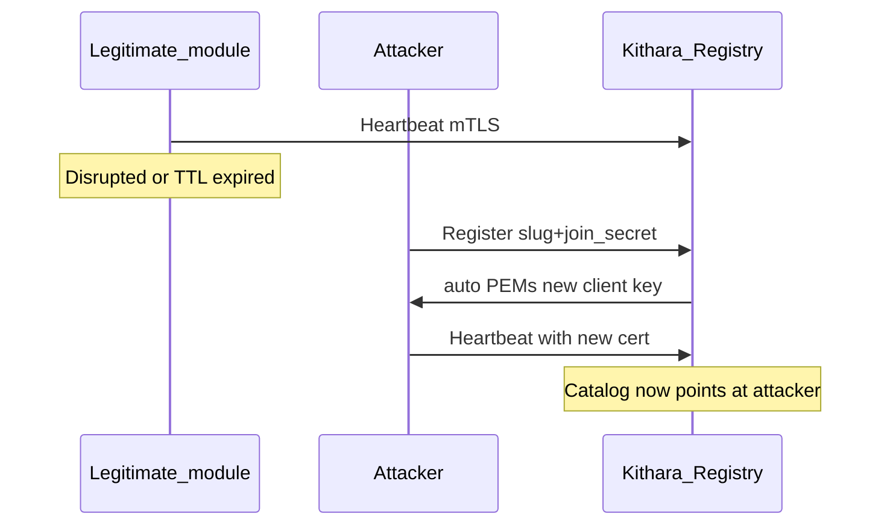

# Security audit (MVP)

Living audit of trust assumptions across the Module mesh, auth vertical, library/storage, and guest paths. Not a full product pen-test — focused on **who can become trusted**, **who gets admin**, and **what tokens/keys actually do**.

**Last review:** Phases 1–3 completion (Jul 2026). **Active remediations: Phases 4–6** (parallel). Revisit when Channel peer pinning, guest refresh, and Bes roles land.

**Remediation map:** fixes are owned by [implementation-plan](implementation-plan.md) Phases **4–6** (parallel) and **8** (verify). Mesh residual `MESH-REG-*` stays ops + product backlog (not Phase 1-complete).

---

## Trust model (mesh)

| Stage | What authenticates | What does not |
|-------|--------------------|---------------|
| `Register` | Join secret for that **slug** (`BARDIE_JOIN_SECRETS`) | Prior client cert (unless caller happens to present one) |
| Steady state (`Heartbeat`, work RPCs) | mTLS client cert signed by host CA | Join secret |
| Host CA / server TLS | Files under `BARDIE_GRPC_TLS_DATA_PATH` | Ephemeral in-memory-only CA when the path is empty |

**Design intent (agreed):** after Register, this module container speaks only with its paired Kithara, and that Kithara dials only that slug/ID. Privileged RPCs (`SeedAdmin`, …) rely on **channel identity**, not a second app-level ACL on the module.

**Auto** bootstrap may return `client_private_key_pem` on `RegisterResponse` — **private mesh / trusted LAN only**. Prefer **preshared** when gRPC may cross untrusted networks ([grpc-module-registry](../interfaces/grpc-module-registry.md)).

### What persists across Kithara restart

| Material | Durable? | Notes |
|----------|----------|--------|
| Host CA + gRPC server cert | **Yes**, if `TlsDataPath` is on a volume | Generate-once; load on later boots |
| Module client certs (auto) | **No** on the host | Re-issued on every successful `Register`; module must store PEMs |
| Module client certs (preshared) | Operator-placed files | Not emitted on the wire |
| Registry + orch catalogs | **No** | In-memory; heartbeat TTL; empty after restart |

---

## Finding index (Phases 1–3 review)

| ID | Sev | Area | Summary | Fix phase |
|----|-----|------|---------|-----------|
| [SEC-01](#sec-01--guest-refresh-tokens-are-dead-on-arrival) | **P0** | Guests | Guest refresh minted but `/api/auth/refresh` only dials auth modules | **6** |
| [SEC-02](#sec-02--ensuretune-skips-storage_key-ownership) | **P0** | Library | `EnsureTune` does not call `BlobKeyLayout.EnsureKeyOwnedBy` | **6** |
| [SEC-03](#sec-03--must_rotate_credentials-is-advisory-forever) | **P0** | Bes | Seed sets rotate flag; Authenticate never enforces / no password-change | **6** |
| [SEC-07](#sec-07--every-successful-login-mints-rolesadmin) | **P0** | Bes / AuthZ | Every mint hardcodes `roles=[admin]` | **6** |
| [SEC-04](#sec-04--jwks-resolver-uses-sync-over-async) | **P1** | Auth JWT | `GetAwaiter().GetResult()` in signing-key resolver | **6** |
| [SEC-05](#sec-05--guest-exchange-unauthenticated--no-rate-limit) | **P1** | Guests | Open `POST …/guest/exchange`; short codes brute-forceable | **6** |
| [SEC-06](#sec-06--work-port-mtls-trusts-ca-only--not-hostslug-pinned) | **P1** | Module.Channel | Work-port accepts any mesh-CA client cert; host dials skip server pin | **4** |
| [MESH-REG-001](#mesh-reg-001--slug-takeover-via-join-secret-auto) | High* | Registry | Join secret + Register window → slug takeover (auto) | Ops + backlog |
| MESH-REG-002 | Residual | Registry | Auto private-key-on-wire | Ops (`preshared`) |
| MESH-REG-003 | Residual | Registry | Cert CN = slug, not instance | Tied to MESH-REG-001 |
| MESH-REG-004 | Residual | Registry | Ephemeral TLS data dir → re-key storm | Ops (durable volume) |

\*High when join secrets leak or `:5000` is reachable beyond a private overlay; expected residual for auto on a closed Compose network.

---

## SEC-01 — Guest refresh tokens are dead-on-arrival

**Severity:** P0  
**Component:** Guest JWT mint + `POST /api/auth/refresh`  
**Fix:** Phase **6**

Guest JWT service mints refresh tokens, but refresh REST only dials auth-module `Refresh`. There is no host path for the guest provider — clients hold a useless refresh.

**Remediation:** Host-side guest refresh on `POST /api/auth/refresh` — detect Kithara guest (e.g. `bardie_provider=kithara.guest`), validate refresh, remint access until Struna teardown / capped lifetime (matches locked “refresh until Struna teardown”). Do not dial auth modules for guest refresh.

---

## SEC-02 — EnsureTune skips `storage_key` ownership

**Severity:** P0  
**Component:** `LibraryService.EnsureTune`  
**Fix:** Phase **6**

gRPC checks `module_slug ==` caller identity, then passes `StorageKey` through without `BlobKeyLayout.EnsureKeyOwnedBy`. Blob Put/Get already enforce the `tunes/<slug>/…` prefix; Tune metadata can claim another module’s key.

**Remediation:** Call `EnsureKeyOwnedBy(callerSlug, storageKey)` (or reject empty/foreign keys) before upsert.

---

## SEC-03 — `must_rotate_credentials` is advisory forever

**Severity:** P0  
**Component:** Bes `SeedAdmin` / `Authenticate`  
**Fix:** Phase **6** (Bes + orch)

`SeedAdmin` sets `MustRotateCredentials=true` and logs a one-time password, but Authenticate always returns/mints with rotate cleared and there is no password-change / binding-update path. Seeded password keeps working.

**Remediation:** Persist and honor the flag on Authenticate (return `must_rotate_credentials=true` and mint restricted tokens until change); password-change via Authenticate bag (`new_password` when rotating); clear flag on success.

---

## SEC-07 — Every successful login mints `roles=[admin]`

**Severity:** P0  
**Component:** Bes Authenticate / Refresh / SeedAdmin mint  
**Fix:** Phase **6** (Bes; orch must not invent admin)

Authenticate, Refresh, and SeedAdmin hardcode `roles=[admin]` into JWT/claims. Any valid Bes credential is full admin — privilege escalation in the mint path, not “multi-user polish later.”

**Remediation:** Persist roles on user/binding; return those on mint/refresh. `SeedAdmin` alone creates `admin`; later subjects default `user` (or empty) unless seeded.

---

## SEC-04 — JWKS resolver uses sync-over-async

**Severity:** P1  
**Component:** `AuthAuthenticationExtensions` IssuerSigningKeyResolver  
**Fix:** Phase **6**

Resolver calls `GetAllSigningKeysAsync(...).GetAwaiter().GetResult()` — deadlock / thread-pool risk under sync contexts.

**Remediation:** Async-safe key material (cached keys refreshed on a timer / background task; resolver reads the cache only).

---

## SEC-05 — Guest exchange unauthenticated + no rate limit

**Severity:** P1  
**Component:** `POST …/guest/exchange`  
**Fix:** Phase **6** (already listed as open)

Endpoint is open; short guest codes are brute-forceable without rate limiting.

**Remediation:** Per-IP / per-Struna rate limits + lockout after N failures (and optional CAPTCHA later — out of MVP).

---

## SEC-06 — Work-port mTLS trusts CA only — not host↔slug pinned

**Severity:** P1  
**Component:** `Bardie.Module.Channel` (`UseBardieModuleWorkGrpc`, host→module dials)  
**Fix:** Phase **4** (Channel hardening as Neck intensifies dials)

**Not a Bes `SeedAdmin` special-case.** Design already says only the paired Kithara may call privileged work RPCs. Bes correctly assumes channel auth = host identity.

**Gap:** work-port validation accepts any client cert that chains to the mesh CA (a module `CN=magpie` would pass). Host→module dials use `trustRemoteServerCertificate` (any work-port server cert). Network isolation in Compose may hide this; crypto identity does not yet match the bilateral pairing design.

**Remediation (Channel):**
- Inbound on module work-port: require host identity (e.g. `CN=kithara` / dedicated host EKU), not merely CA chain.
- Outbound host→module: pin module work-port identity to registered slug (SAN/CN), not “any cert.”

---

## MESH-REG-001 — Slug takeover via join secret (auto)

**Severity:** High when join secrets leak or the mesh is reachable beyond a private overlay; expected residual risk for auto on a closed Compose network  
**Component:** Module Registry `Register` + ModuleChannel `auto` issuer  
**Fix:** Ops mitigations today; product pinning = backlog (not blocking Phases 4–6)

### Vector

An attacker who knows the join secret for slug `S` can replace the legitimate module for `S`:

1. Wait for a **Register window** — cold start, Kithara restart (empty registry), or disrupt the real module until heartbeat TTL expires and the janitor drops `S`.
2. Call `Register` with slug `S` and the correct join secret (and any advertise address / capabilities they choose).
3. In **auto**, Kithara issues a **new** client cert + private key on the response and upserts catalogs.
4. Subsequent Heartbeats / dials treat the attacker as module `S`.

No race against the honest module’s cert is required: the host does **not** require presenting the previously issued client cert to re-Register, and does **not** pin “only serial N may speak as `S`.”

### Prerequisites

- Reachability to Kithara module gRPC (`:5000`).
- Knowledge of `BARDIE_JOIN_SECRETS[S]` (or ability to read Compose/secret store).
- Auto mode (or any mode that accepts Register with only the join secret as bootstrap).

Without the join secret, this inject fails at `Register`.

### Why this exists (design, not accidental)

Join secret is the **bootstrap** credential before mTLS exists. Auto deliberately trades “operator pre-places certs” for “first handshake pairs on a private network.” That implies: **whoever holds the join secret can pair** whenever the registry will accept `Register` for that slug.

### Mitigations (ops, today)

| Control | Effect |
|---------|--------|
| Keep `:5000` on an internal overlay only | Shrinks who can attempt Register |
| Treat join secrets as root credentials; rotate on suspicion | Shrinks who can succeed |
| Durable `BARDIE_GRPC_TLS_DATA_PATH` volume | Stable CA; avoids re-keying the whole mesh every Kithara restart |
| Prefer `BARDIE_MODULE_MTLS_BOOTSTRAP=preshared` off private mesh | No private keys on Register; operator-placed identity |

### Mitigations (product, backlog)

- Refuse auto re-Register for a live slug unless the caller presents the current client cert (or an admin break-glass).
- Persist or pin issued client cert thumbprints / serials per slug; revoke on replace.
- Optional durable registry so restart alone does not reopen every slug’s Register window.

---

## Related residual risks (mesh)

| ID | Summary | Notes |
|----|---------|--------|
| `MESH-REG-002` | Auto private-key-on-wire | Any observer on the Register path in auto mode sees module client private keys. Private mesh assumption. |
| `MESH-REG-003` | Cert CN = slug, not instance | Interceptor validates CA + CN slug; does not bind to a single issuance after upsert. Same root cause as `MESH-REG-001` for takeover quality. |
| `MESH-REG-004` | Ephemeral TLS data dir | Every Kithara restart = new CA + forced re-Register storm + repeated auto key delivery. |

---

## Audit checklist (operators)

- [ ] Module gRPC not published on a public interface
- [ ] Join secrets unique per slug, not reused across environments
- [ ] `TlsDataPath` mounted on durable storage in any long-lived deploy
- [ ] Bootstrap mode = `preshared` whenever the channel leaves a trusted private network
- [ ] Document who can read Compose/secret store (same trust as join secrets)
- [ ] After Phase 6: guest refresh works or is not minted; guest exchange rate-limited
- [ ] After Phase 6: Bes roles from binding; `must_rotate` enforced
- [ ] After Phase 4: Channel host↔slug pin verified on work dials

---

## Related

- [implementation-plan](implementation-plan.md) — Phase 4–6 remediation ownership
- [grpc-module-registry](../interfaces/grpc-module-registry.md) — dial rules + auto vs preshared
- [grpc-auth-adapter](../interfaces/grpc-auth-adapter.md) — SeedAdmin / privileged RPCs
- [module-channel](../operations/module-channel.md) — Channel library
- [configuration](../operations/configuration.md) — `BARDIE_JOIN_SECRETS`, TLS env knobs
- [deployment](../operations/deployment.md) — ports and networking
- Org modules-beyond-Bardie — ([org 07](https://github.com/Bardie-radio/.github/blob/main/profile/docs/architecture/07-modules-beyond-bardie.md))

**Read next:** [implementation-plan.md](implementation-plan.md)
