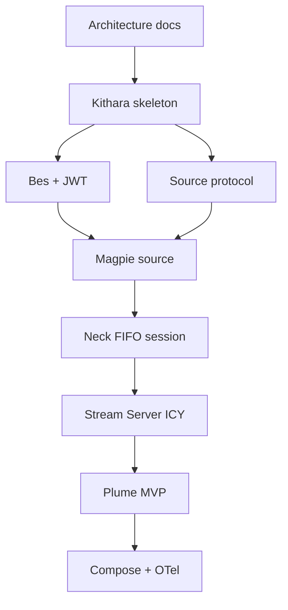

# MVP v0.1 Milestones

Delivery order only — no calendar dates.

## Ordered milestones

1. **Architecture docs** (this repository) — ADRs, interfaces, deployment shape
2. **Kithara skeleton** — feature-first API layout, auth orchestrator, module registry, user + binding tables
3. **Bes + JWT sessions** — discovery, authenticate/refresh (Bes mints JWT); bootstrap admin; Kithara JWKS verify
4. **Source module protocol** — gRPC + FIFO PCM proof with Magpie (`StartTrack` / `StopTrack`)
5. **Neck refactor** — alive-on-create, session FIFO, silence feeder, hosted FFmpeg supervisor
6. **Stream Server** — ICY-over-HTTP `/stream/{slug}`
7. **Plume** — `/`, `/player/{slug}`, discovery-driven login (optional client)
8. **Compose bundle** — edge + 4 apps (`plume`, `kithara`, `magpie`, `bes`); wire to **external** OTel collector; join secrets for modules

**Related:** [v0.1-scope.md](v0.1-scope.md)

**Read next:** [../spike/prototype-neck-ffmpeg.md](../spike/prototype-neck-ffmpeg.md)
