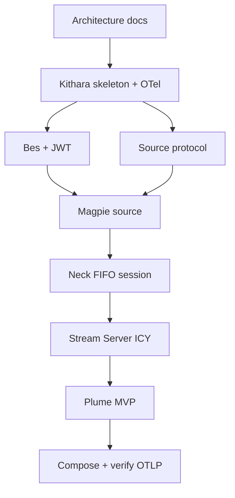

# MVP v0.1 Milestones

Delivery order only — no calendar dates.

**Current stage:** milestone **4** (source module protocol / Kithara Phase 3). Milestones 1–3 are done.

## Ordered milestones

1. **Architecture docs** (this repository) — ADRs, interfaces, deployment shape
2. **Kithara skeleton** — feature-first API layout, module registry, persistence, **OTel bootstrap** (`bardie.kithara`) — **done**
3. **Bes + JWT sessions** — discovery, authenticate/refresh (Bes mints JWT); bootstrap admin; Kithara JWKS verify; OTel `bardie.auth.bes` — **done**
4. **Source module protocol** — gRPC + FIFO PCM proof with Magpie (`StartTrack` / `StopTrack`); OTel `bardie.source.magpie` — **current**
5. **Neck refactor** — alive-on-create, session FIFO, silence feeder, hosted FFmpeg supervisor (custom spans)
6. **Stream Server** — ICY-over-HTTP `/stream/{slug}`
7. **Plume** — `/`, `/player/{slug}`, discovery-driven login (optional client); OTel `bardie.plume`
8. **Compose bundle** — edge + 4 apps; join secrets; **confirm** OTLP → external collector (instrumentation already present)

**Related:** [v0.1-scope.md](v0.1-scope.md) · [implementation-plan.md](implementation-plan.md)

**Read next:** [implementation-plan.md](implementation-plan.md) for work packages · [../spike/prototype-neck-ffmpeg.md](../spike/prototype-neck-ffmpeg.md)
