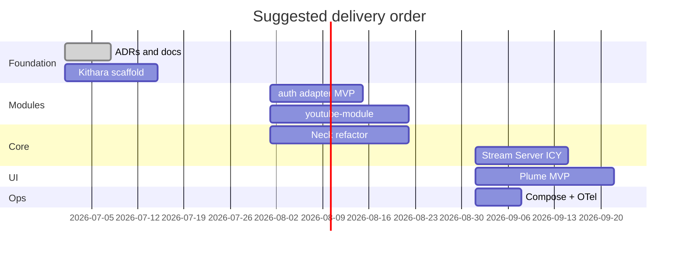

# MVP v0.1 Milestones

## Ordered milestones

1. **Architecture docs** (this repository) — ADRs, interfaces, deployment shape
2. **Kithara skeleton** — API, auth orchestrator stub, module registry
3. **Login+password auth adapter** *(name TBD)* — gRPC adapter + form_schema discovery
4. **Source module protocol** — gRPC + socket proof with YouTube
5. **Neck refactor** — source instances, scoped DI, stream lifecycle API
6. **Stream Server** — ICY-over-HTTP `/stream/{slug}`
7. **Plume** — `/`, `/player/{slug}`, discovery-driven login
8. **Compose bundle** — proxy, OTel collector, end-to-end demo

**Related:** [v0.1-scope.md](v0.1-scope.md)

**Read next:** [../spike/prototype-neck-ffmpeg.md](../spike/prototype-neck-ffmpeg.md)
