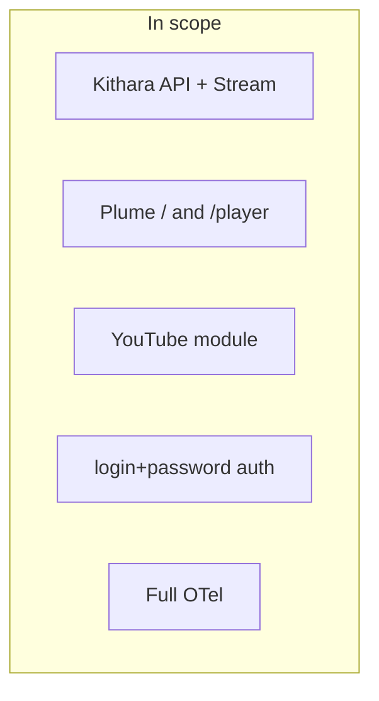

# MVP v0.1 Scope

## In scope

- Docker Compose reference stack (4 app containers + proxy)
- Kithara REST: Struna CRUD, play/skip/stop, now-playing
- Kithara-native streaming: FFmpeg → Stream Server; `GET /stream/{slug}` ICY
- User-chosen slugs; unique among active Strunas
- Struna access: independent playback (public/protected/private) and control (private/protected)
- Protected listen token via query param (MVP)
- Plume: `/`, `/player/{slug}`; browser player off by default
- Login+password auth adapter (module and repo name TBD)
- YouTube source module (gRPC + socket; name TBD)
- OTel on **all** components

## Out of scope

- OIDC auth adapter (Zitadel, Google; v0.2)
- Discord bot
- Telegram bot
- File upload module
- Icecast output adapter (community demand)
- HLS output adapter
- `/player` PWA
- One-time listen tokens for private + legacy players
- HTTP Basic Auth for protected streams (v0.2 eval)
- Multi-instance Kithara horizontal scaling

**Related:** [org deployment](https://github.com/Bardie-radio/.github/blob/main/profile/docs/architecture/05-deployment.md) · [v0.1-milestones.md](v0.1-milestones.md)

**Read next:** [v0.1-milestones.md](v0.1-milestones.md)
