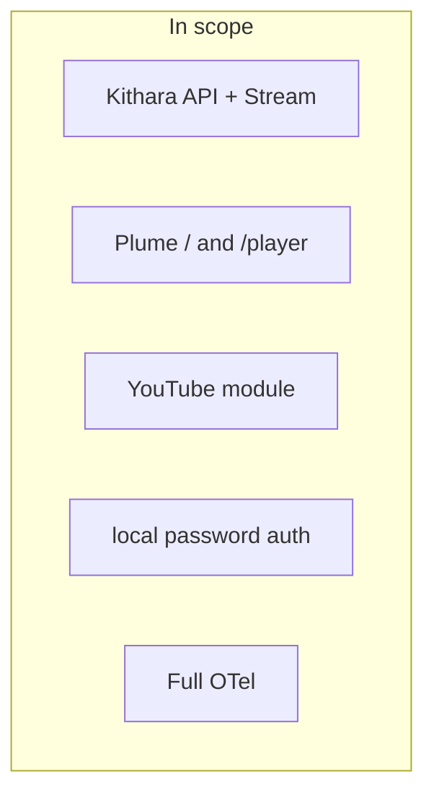

# MVP v0.1 Scope

## In scope

- Docker Compose reference stack (4 app containers + edge proxy; **OTel collector external**/optional)
- Kithara REST: Struna create/pause/stop/delete, play/skip, queue, now-playing, auth discovery/authenticate
- Kithara-native streaming: session FIFO → FFmpeg (alive for Struna life) → Stream Server; `GET /stream/{slug}` ICY
- User-chosen slugs; unique among **alive** Strunas; freed on stop
- Struna access: independent playback (public/protected/private) and control (private/protected)
- Protected listen token via query param (MVP); listen/guest secrets owned by Kithara
- Plume: `/`, `/player/{slug}`; browser player off by default (optional client — stack works without it)
- Local login+password provider (built-in; Kithara JWT sessions)
- YouTube source module (gRPC + FIFO PCM; name TBD)
- OTel on **all** Bardie app components

## Out of scope

- OIDC auth adapter (Zitadel, Google; v0.2)
- Discord bot
- Telegram bot
- File upload module
- Icecast / HLS as primary output (keep adapters possible later; not MVP)
- `/player` PWA
- One-time listen tokens for private streams on legacy players
- HTTP Basic Auth for protected streams (v0.2 eval)
- Multi-instance Kithara horizontal scaling
- Account-linking UI (model locked; ship when multi-provider is live)
- `PrepareTrack` RPC (informal prewarm only)

**Related:** [org deployment](https://github.com/Bardie-radio/.github/blob/main/profile/docs/architecture/05-deployment.md) · [v0.1-milestones.md](v0.1-milestones.md)

**Read next:** [v0.1-milestones.md](v0.1-milestones.md)
