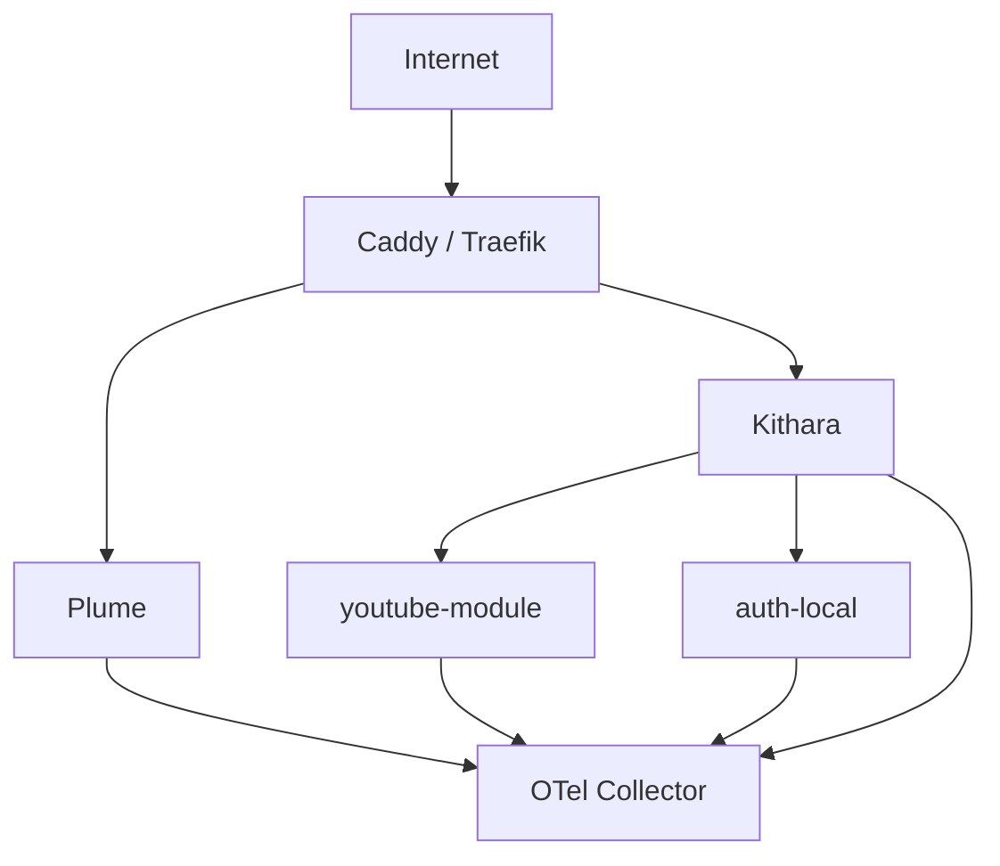

# Deployment

## Docker Compose MVP (authenticated)

| Service | Image | Published |
|---------|-------|-----------|
| proxy | caddy | :443 |
| plume | bardie-plume | internal |
| kithara | bardie-kithara | internal |
| youtube-module | bardie-source-youtube | internal |
| auth-local | bardie-auth-local | internal |
| otel-collector | otel/opentelemetry-collector | optional |

**4 app containers** + proxy + optional collector.

## Path routing

See [interfaces/uri-routing.md](../interfaces/uri-routing.md).

## Dynamic Strunas

No port per stream — GUID internal, slug in URL path. Slug freed when Struna stops.

**Related:** [operations/configuration.md](configuration.md)

**Read next:** [configuration.md](configuration.md)
