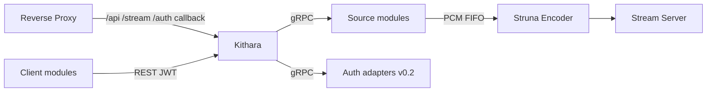

# Deployment (Kithara container)

How to run the **Kithara container** inside a Bardie stack. Whole-stack layout, edge modes, and Compose orchestration belong in the [org deployment guide](https://github.com/Bardie-radio/.github/blob/main/profile/docs/architecture/05-deployment.md).

## What this container does

| Surface | Role |
|---------|------|
| REST `/api/*` | Control plane for client modules |
| Auth HTTP | Discovery, authenticate, refresh, OIDC callback |
| Stream server `/stream/{slug}` | ICY-over-HTTP audio to listeners |
| gRPC server | Module registration / control (internal only) |
| Neck | Session FIFOs, silence, FFmpeg encoders, track jobs |

## Ports

| Port (default) | Protocol | Audience | Notes |
|----------------|----------|----------|-------|
| `8080` | HTTP | Edge → Kithara | REST + stream + auth callback |
| `5000` | gRPC / HTTP/2 | Source & auth modules | **Never** publish publicly |

## Volumes & runtime deps

| Need | Why |
|------|-----|
| FFmpeg on `PATH` (or bundled) | Struna Encoder processes |
| Writable scratch for FIFOs | Per-Struna session FIFOs |
| Database volume or external DB | Users, bindings, Struna metadata, library |
| OTLP reachability | Export to **external** collector if configured |

## Module attach

Drop a module on the Compose network with the **join secret** and it registers. Risks (spoofed slug, open gRPC, FIFO access) and mitigations: see org [05-deployment](https://github.com/Bardie-radio/.github/blob/main/profile/docs/architecture/05-deployment.md) and [source-modules](../domains/source-modules.md).

## Networking expectations

- **Inbound from edge:** HTTP for REST, ICY, OIDC callback. Long-lived `/stream/{slug}` — disable short proxy read timeouts for that path.
- **Inbound from modules:** gRPC register + control on the internal gRPC listen address.
- **Outbound:** dial module addresses from registration; OTLP to external collector.
- **FIFOs:** shared volume / namespace as required by the module contract.

## Path responsibilities (this container only)

| Path prefix | Handler inside Kithara |
|-------------|------------------------|
| `/api/*` | REST API + auth |
| `/stream/{slug}` | Stream Server |

`/`, `/player/*` are **not** served here — Plume (or another client) at the edge.

## Health & lifecycle

- Ready when HTTP responds and gRPC accepts registrations.
- Stopping the container tears down alive Struna encoders and open stream connections.
- Horizontal multi-instance Kithara is **out of MVP scope**.

## Related

- Org stack: [05-deployment](https://github.com/Bardie-radio/.github/blob/main/profile/docs/architecture/05-deployment.md)
- Env vars: [configuration.md](configuration.md)
- Route map: [uri-routing.md](../interfaces/uri-routing.md)

**Read next:** [configuration.md](configuration.md)
