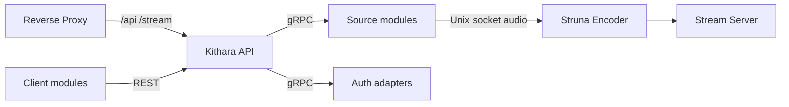

# Deployment (Kithara container)

How to run the **Kithara container** inside a Bardie stack. Whole-stack layout, edge modes, and Compose orchestration belong in the [org deployment guide](https://github.com/Bardie-radio/.github/blob/main/profile/docs/architecture/05-deployment.md).

## What this container does

One process (or one container image) that hosts:

| Surface | Role |
|---------|------|
| REST `/api/*` | Control plane for client modules |
| Stream server `/stream/{slug}` | ICY-over-HTTP audio to listeners |
| gRPC server | Module registration / control (source + auth) |
| Neck | Per-Struna FFmpeg encoders + source-instance lifecycle |

## Ports

| Port (default) | Protocol | Audience | Notes |
|----------------|----------|----------|-------|
| `8080` | HTTP | Edge → Kithara | REST + stream server (path-split or host routing at the edge) |
| `5000` | gRPC / HTTP/2 | Source & auth modules | Not published publicly; Compose/internal network only |

Exact port numbers are configuration — see [configuration.md](configuration.md). Edge must forward `/api/*` and `/stream/*` to the HTTP port; gRPC stays off the public internet.

## Volumes & runtime deps

| Need | Why |
|------|-----|
| FFmpeg on `PATH` (or bundled) | Struna Encoder processes |
| Writable scratch / socket dir | Unix domain sockets for source instances |
| Database volume or external DB | Struna metadata, library refs (`DbProvider`) |
| OTLP reachability | Export traces/metrics/logs if collector configured |

## Networking expectations

- **Inbound from edge:** HTTP for REST and ICY streams. Long-lived `/stream/{slug}` connections — disable short proxy read timeouts for that path.
- **Inbound from modules:** gRPC register + control on the internal gRPC listen address.
- **Outbound to modules:** Kithara dials source/auth module addresses advertised at registration (`bardie_*` services; short Compose DNS aliases may also exist).
- **Unix sockets:** Audio plane between a source instance and the encoder — shared volume or same network namespace as needed by the module contract ([source-instances](../domains/source-instances.md)).

## Repos needing follow-up

| Port / network contract | Follow up in |
|-------------------------|----------------|
| Edge publish of `:8080` paths `/api/*`, `/stream/*` | Org [05-deployment](https://github.com/Bardie-radio/.github/blob/main/profile/docs/architecture/05-deployment.md) |
| gRPC `:5000` (internal only) | Source/auth module Compose; never publish on the public edge |
| Plume `/`, `/player/*` | **bardie-plume** + org edge path map |

## Path responsibilities (this container only)

| Path prefix | Handler inside Kithara |
|-------------|------------------------|
| `/api/*` | REST API |
| `/stream/{slug}` | Stream Server |

`/`, `/player/*` are **not** served by this container — they belong to Plume (or another client module) at the edge.

## Health & lifecycle

- Ready when HTTP responds and gRPC accepts registrations.
- Stopping the container tears down active Struna encoders and open stream connections.
- Horizontal multi-instance Kithara is **out of MVP scope** (shared stream state / encoder ownership is unresolved).

## Related

- Org stack process: [05-deployment](https://github.com/Bardie-radio/.github/blob/main/profile/docs/architecture/05-deployment.md)
- Env vars: [configuration.md](configuration.md)
- Route map: [uri-routing.md](../interfaces/uri-routing.md)

**Read next:** [configuration.md](configuration.md)
