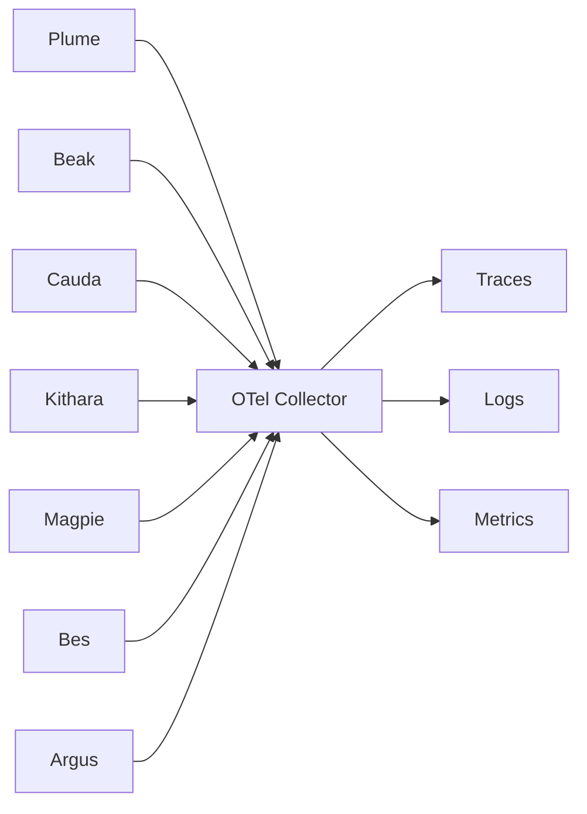

# Observability

**Principle: everything is under coverage.** If it rides the Bardie bus, it exports OTLP ([ADR 008](../adrs/008-otel-observability.md)).

## Mandatory telemetry

| Component | service.name |
|-----------|---------------------|
| Kithara | `bardie.kithara` |
| Plume | `bardie.plume` |
| Beak | `bardie.beak` |
| Cauda | `bardie.cauda` |
| Magpie | `bardie.source.magpie` |
| Starling | `bardie.source.starling` |
| Catbird | `bardie.source.catbird` |
| Bes | `bardie.auth.bes` |
| Argus | `bardie.auth.argus` |
| Hecate | `bardie.auth.hecate` |

## Module contract

Every module must:

1. Export OTLP (traces, metrics, logs)
2. Accept + forward W3C `traceparent` on inbound calls
3. Inject trace context on outbound calls

## Span attributes

- `struna.id`, `struna.slug`, `playback.access`, `control.access`
- `source.module`, `source.track_job.id`, `auth.provider.id`
- **Never** log tokens or passwords

## Trace scenarios

1. Login: Client → Kithara authenticate/callback → Bes or Argus → module JWT (+ refresh); Kithara verifies later via JWKS
2. Play: Client → API → Magpie `StartTrack` → Neck FIFO/encoder → Stream Server
3. Legacy listen: Player → `/stream/{slug}` (root span with slug attribute)

## Reference stack

Grafana Tempo + Loki + Prometheus via OTel Collector. Backends swappable — OTLP is normative.

## Repos needing follow-up

| Naming / contract | Follow up in |
|-------------------|----------------|
| `bardie.plume` OTLP export | **plume** |
| `bardie.beak` / `bardie.cauda` | **beak**, **cauda** |
| `bardie.source.magpie` (and siblings) | **magpie**, **starling**, **catbird** |
| `bardie.auth.bes` (and siblings) | **bes**, **argus**, **hecate** |
| Collector Compose / optional backends | Org [05-deployment](https://github.com/Bardie-radio/.github/blob/main/profile/docs/architecture/05-deployment.md) |

**Related:** [ADR 008](../adrs/008-otel-observability.md) · [configuration.md](configuration.md)

**Read next:** [../mvp/v0.1-scope.md](../mvp/v0.1-scope.md)
